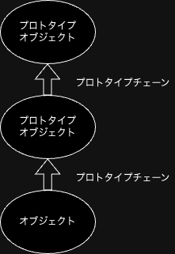
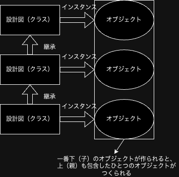

# この記事について

これまで「JavaScriptはプロトタイプベースの言語」ということをチラチラと見ていたが、「そもそもプロトタイプベース」ってなんなん？ って人に説明できるレベルになかったのでざっくりまとめてみる。

（後から追記ですがいろいろ脱線します）

~~また、現在のJavaScript界隈ではclass構文が毛嫌いされている節がある（と思っている）が、この傾向についても自分の中で腹落ちさせたい。~~

↑この記事内では諦めました。別で書きたい。

# プロトタイプベース

> オブジェクト指向プログラミング(OOP)では、オブジェクトを扱います。オブジェクトを扱う以上は、オブジェクトを生成する必要があります。

> しかし、オブジェクトの生成方式は、OOPで統一的な決まりはありません。言語によって異なるのです。言語によりオブジェクト生成の細部は異なりますが、生成方法は大きく分けて「クラスベース」と「プロトタイプベース」があります。

[https://typescriptbook.jp/reference/values-types-variables/object/prototype-based-programming](https://typescriptbook.jp/reference/values-types-variables/object/prototype-based-programming)

> **プロトタイプベース** ([英](https://ja.wikipedia.org/wiki/%E8%8B%B1%E8%AA%9E): Prototype-based) は、[オブジェクト指向プログラミング](https://ja.wikipedia.org/wiki/%E3%82%AA%E3%83%96%E3%82%B8%E3%82%A7%E3%82%AF%E3%83%88%E6%8C%87%E5%90%91%E3%83%97%E3%83%AD%E3%82%B0%E3%83%A9%E3%83%9F%E3%83%B3%E3%82%B0)（OOP）のスタイルのひとつであり、[オブジェクト](https://ja.wikipedia.org/wiki/%E3%82%AA%E3%83%96%E3%82%B8%E3%82%A7%E3%82%AF%E3%83%88_(%E3%83%97%E3%83%AD%E3%82%B0%E3%83%A9%E3%83%9F%E3%83%B3%E3%82%B0))の生成に既存[オブジェクト](https://ja.wikipedia.org/wiki/%E3%82%AA%E3%83%96%E3%82%B8%E3%82%A7%E3%82%AF%E3%83%88_(%E3%83%97%E3%83%AD%E3%82%B0%E3%83%A9%E3%83%9F%E3%83%B3%E3%82%B0))の複製を用いるスタイルを指している。これには直後にメンバを拡充するための空オブジェクトの複製も含まれている。このスタイルは、インスタンスベース（Instance-based）とも呼ばれている。これと対比されるOOPスタイルに[クラスベース](https://ja.wikipedia.org/wiki/%E3%82%AF%E3%83%A9%E3%82%B9%E3%83%99%E3%83%BC%E3%82%B9)がある。

> プロトタイプベースOOPの原点は[Smalltalk](https://ja.wikipedia.org/wiki/Smalltalk)方言の[Self](https://ja.wikipedia.org/wiki/Self)であり、Smalltalkのクラスベース設計を平易化する試みから1987年に誕生している。他には[Lua](https://ja.wikipedia.org/wiki/Lua)、[JavaScript](https://ja.wikipedia.org/wiki/JavaScript)、[Etoys](https://ja.wikipedia.org/wiki/Etoys)、[ECMAScript](https://ja.wikipedia.org/wiki/ECMAScript)、[REBOL](https://ja.wikipedia.org/wiki/REBOL)、[Io](https://ja.wikipedia.org/wiki/Io_(%E3%83%97%E3%83%AD%E3%82%B0%E3%83%A9%E3%83%9F%E3%83%B3%E3%82%B0%E8%A8%80%E8%AA%9E))、[TypeScript](https://ja.wikipedia.org/wiki/TypeScript)などがある。

> プロトタイプとは、複製元になった[オブジェクト](https://ja.wikipedia.org/wiki/%E3%82%AA%E3%83%96%E3%82%B8%E3%82%A7%E3%82%AF%E3%83%88_(%E3%83%97%E3%83%AD%E3%82%B0%E3%83%A9%E3%83%9F%E3%83%B3%E3%82%B0))を意味しており、複製先のオブジェクトから見てそう呼ばれる。プロトタイプは同時にそのオブジェクトの暗黙の[委譲](https://ja.wikipedia.org/wiki/%E5%A7%94%E8%AD%B2)先になり、これはプロトタイプを複製が[継承](https://ja.wikipedia.org/wiki/%E7%B6%99%E6%89%BF_(%E3%83%97%E3%83%AD%E3%82%B0%E3%83%A9%E3%83%9F%E3%83%B3%E3%82%B0))していることと同じになる。

> プロトタイプベースはプログラマに、オブジェクトをどう振る舞わせるかということのみに集中させて、オブジェクトが実際に振る舞えるかどうかの疑問を後回しにできる環境を提供する[[3]](https://ja.wikipedia.org/wiki/%E3%83%97%E3%83%AD%E3%83%88%E3%82%BF%E3%82%A4%E3%83%97%E3%83%99%E3%83%BC%E3%82%B9#cite_note-3)。振る舞いとは[メソッド](https://ja.wikipedia.org/wiki/%E3%83%A1%E3%82%BD%E3%83%83%E3%83%89_(%E8%A8%88%E7%AE%97%E6%A9%9F%E7%A7%91%E5%AD%A6))である。

[https://ja.wikipedia.org/wiki/%E3%83%97%E3%83%AD%E3%83%88%E3%82%BF%E3%82%A4%E3%83%97%E3%83%99%E3%83%BC%E3%82%B9](https://ja.wikipedia.org/wiki/%E3%83%97%E3%83%AD%E3%83%88%E3%82%BF%E3%82%A4%E3%83%97%E3%83%99%E3%83%BC%E3%82%B9)

つまり、オブジェクト指向という大枠の中に「クラスベース」と「プロトタイプベース」があり、それぞれの流派に沿ってオブジェクトを生成する。

JavaScriptはプロトタイプベースであるものの、構文としてES6以降より「class」が用意されている。このclassはあくまで現代 (ES6の時点) において主流であったクラスベースのオブジェクト指向プログラミングに合わせて用意したものであって、JavaScript自体はclassベースではないためそれっぽく書けるもの (プロトタイプベースのシンタックスシュガー) である。

## JavaScriptとプロトタイプベース

プロトタイプベースのオブジェクト指向言語は、JavaScript以外にもいくつかあります。

- Lua
- Etoys
- REBOL
- Io

この中でも「純粋なプロトタイプベース」としてはIoが挙げられている印象（ただサービスに使われているケースは全然見当たらない）

「純粋」という観点で、JavaScriptはそうではないのか？ というとプロトタイプベースとしては異端ということが指摘されている。

> 純粋なプロトタイプベースのOOPでは、クラスやJavaScriptのprototypeオブジェクトのようなものは無い。新しいオブジェクトを作るには、new演算子によるインスタンス化ではなくオブジェクトの複製を作ることで自分が欲しいオブジェクトを作成していく。ここでは、プロトタイプベースのOOPの例として、[io](http://iolanguage.org/)という言語で説明する。ioは純粋なプロトタイプベースのOOPだ。また、ioには制御構文用の文法が無く全てが(if文ですらも)メソッドである。

> 個人的な意見になるが、JavaScriptをプロトタイプベースのOOPと言い切っている人は、プロトタイプベースのOOPがどういったものかを理解していない、もしくはioや[Self](http://www.selflanguage.org/)のような言語を触ったことがない人だろう。なぜならJavaScriptは何の留保も無しにプロトタイプベースと言い切るにはあまりに奇妙だからだ。何にせよ、ES6からは[class構文](https://github.com/lukehoban/es6features#classes)が追加されたので、JavaScriptをプロトタイプベースのOOPと言うのはもはや適切ではないだろう。

[https://anatoo.hatenablog.com/entry/2015/05/05/163225](https://anatoo.hatenablog.com/entry/2015/05/05/163225)

参考までに、JavaScript以外のプロトタイプベース言語での実際の用途や活用例 (ChatGPT o3) 


## JavaScriptでのclass

> クラスはオブジェクトを作成するためのテンプレートです。処理するためのコードでデータをカプセル化します。 JS のクラスは[プロトタイプ](https://developer.mozilla.org/ja/docs/Web/JavaScript/Guide/Inheritance_and_the_prototype_chain)に基づいて構築されていますが、一部の構文や意味はクラスに固有です。

[https://developer.mozilla.org/ja/docs/Web/JavaScript/Reference/Classes](https://developer.mozilla.org/ja/docs/Web/JavaScript/Reference/Classes)

JavaScriptにおいて、クラスは以下のような定義ができる。

### 宣言型のクラス定義

```javascript
class Rectangle {
  constructor(height, width) {
    this.height = height;
    this.width = width;
  }
  
  // メソッドの定義…
}
```

クラスベースの言語でも一般的な、よく見る形式である。

### **無名クラス式 + 変数代入**

```javascript
// 式（クラスは無名だが、変数に代入される）
const Rectangle = class {
  constructor(height, width) {
    this.height = height;
    this.width = width;
  }
  
  // メソッドの定義…
};
```

この形でのクラス定義についてはクラスベースのオブジェクト指向言語であるJavaではできない（はず）。

やるとしても以下のように匿名クラスを定義して代入、という形になる（以下はChatGPTでのサンプルコード）

```java
// 無名クラス（通常はインターフェースの実装に使う）
Runnable r = new Runnable() {
  public void run() {
    System.out.println("Running");
  }
};
```

---

**※個人的補足**

Javaの場合、再利用しない匿名クラスは多くの場合以下のように定義される。

```java
// 関数型インターフェースであることを宣言
@FunctionalInterface 
interface Example{
    public void display();  // 抽象メソッド
}
```

Interfaceを実装する匿名クラス

```java
Example example = new Example(){
    // 抽象メソッドの実装を提供
    @Override
    public void display() {
        System.out.println("Hello World!");
    }
};
```

参照: [【Java】匿名クラスとラムダ式〜インターフェースの実装〜 - Qiita](https://qiita.com/shibainuu/items/d60f094fbd18d4fec8c6#%E5%8C%BF%E5%90%8D%E3%82%AF%E3%83%A9%E3%82%B9%E3%82%92%E4%BD%BF%E7%94%A8%E3%81%99%E3%82%8B%E5%A0%B4%E5%90%88%EF%BC%91)

まずもって関数型インターフェースとは？

> *関数型インタフェース*は、ラムダ式やメソッド参照のターゲットとなる型を提供します。各関数型インタフェースには、その関数型インタフェースの*関数メソッド*と呼ばれる単一の抽象メソッドが含まれており、ラムダ式のパラメータや戻り値の型のマッチングや適応は、そのメソッドに対して行われます。

[https://docs.oracle.com/javase/jp/8/docs/api/java/util/function/package-summary.html](https://docs.oracle.com/javase/jp/8/docs/api/java/util/function/package-summary.html)

> インタフェース型の宣言を、Java言語仕様に定義されている*関数型インタフェース*とすることを目的としていることを示すために使われる情報目的の注釈型です。概念上、1つの関数型インタフェースには抽象メソッドが1つだけあります。[デフォルト・メソッド](https://docs.oracle.com/javase/jp/8/docs/api/java/lang/reflect/Method.html#isDefault--)には実装が1つ含まれているため、それらは抽象メソッドではありません。インタフェースが、`java.lang.Object`のpublicメソッドの1つをオーバーライドする抽象メソッドを宣言する場合も、それはインタフェースの抽象メソッド数に反映*されません*。理由は、そのインタフェースのいずれかの実装に`java.lang.Object`または他の場所からの実装が含まれるからです。

[https://docs.oracle.com/javase/jp/8/docs/api/java/lang/FunctionalInterface.html](https://docs.oracle.com/javase/jp/8/docs/api/java/lang/FunctionalInterface.html)

ここではJavaで例をあげたので、「Javaでいうところの関数型インターフェースとは」だが、単一の抽象メソッドを持つインターフェースのことを指す。抽象メソッドとは、メソッドの宣言（名前や引数など）のみを持ち、具体的な実装を持たないメソッドをいう（中身は実装側で好きにしてねー、定義とか名前だけ決めとっから！ という感じ）。

主にラムダ式やメソッド参照などの、「関数型プログラミングの概念」をサポートするために導入された。

ここではあくまで「プロトタイプベース」「JavaScriptの言語仕様」への理解を目的としているので、もっと深掘りは「関数型プログラミング」なんかの記事作って追いたい。

---

上記の定義方法とJavaScriptでのclass定義を比較すると、JavaScriptにおいては特にInterfaceを仲介せずとも名前のないclassを定義して変数にそのまま代入できてしまう、ということになる。

1ステップ省ける分JavaScriptの方がお手軽にも見えるが……

抽象を許容しすぎると無秩序になり得るので、Interfaceを媒介として定義するという点は言語の仕様としてJavaはしっかりしているなーという感想。

### **名前付きクラス式（別名で定義）**

```javascript
// 式（自分の名前を持つクラス）
const Rectangle = class Rectangle2 {
  constructor(height, width) {
    this.height = height;
    this.width = width;
  }
};
```

> Java/C#には、「**クラスに別名をつけて代入**」するという構文は存在しません。クラス名は宣言と同時に定義する必要があります。ただし、**エイリアス（別名）**のように使いたい場合は、インスタンスを作成して代入することはできます：

ここについては、のちのち深掘りするために4o先生に聞いてみた。

ChatGPT(4o)

> [!note] 回答
> 
> はい、JavaScriptのクラス構文は、JavaやC#と非常に似たオブジェクト指向構文ですが、いくつかの違いや制限もあります。以下、それぞれのパターンについてJavaとC#での対応可否・類似構文を示します。
> 
> ---
> 
> ## **✅ 1.**
> 
> ## **宣言型クラス構文**
> 
> ```plain text
> class Rectangle {
>   constructor(height, width) {
>     this.height = height;
>     this.width = width;
>   }
> }
> ```
> 
> ### **Java / C# での対応例：**
> 
> ### **Java:**
> 
> ```plain text
> public class Rectangle {
>   private int height;
>   private int width;
> 
>   public Rectangle(int height, int width) {
>     this.height = height;
>     this.width = width;
>   }
> }
> ```
> 
> ### **C#:**
> 
> ```plain text
> public class Rectangle {
>   private int height;
>   private int width;
> 
>   public Rectangle(int height, int width) {
>     this.height = height;
>     this.width = width;
>   }
> }
> ```
> 
> ✅ Java・C#ともに完全に対応可能です。JavaScriptと違い、クラス名は常に必要です。
> 
> ---
> 
> ## **⚠️ 2.**
> 
> ## **無名クラス式 + 変数代入**
> 
> ```plain text
> const Rectangle = class {
>   constructor(height, width) {
>     this.height = height;
>     this.width = width;
>   }
> };
> ```
> 
> ### **Java / C# の対応：**
> 
> ### **Java:**
> 
> Javaでは**無名クラス（匿名クラス）という仕組みはありますが、「変数に無名クラスを代入」する用途は主にインターフェースの実装や一時的な継承用途**であり、JavaScriptのように汎用的なオブジェクト設計で使うことはできません。
> 
> ```plain text
> // 無名クラス（通常はインターフェースの実装に使う）
> Runnable r = new Runnable() {
>   public void run() {
>     System.out.println("Running");
>   }
> };
> ```
> 
> ### **C#:**
> 
> C# ではこのような無名クラスの定義はできません。
> 
> ```plain text
> // 無名クラスのようなものは存在しない（匿名型はあるが、メソッドを持てない）
> var obj = new { Height = 100, Width = 200 };  // メソッドを含められない
> ```
> 
> ⚠️ JavaScript特有の構文です。Java/C#では基本的に**クラスは名前付きで定義**しなければなりません。
> 
> ---
> 
> ## **⚠️ 3.**
> 
> ## **名前付きクラス式（別名で定義）**
> 
> ```plain text
> const Rectangle = class Rectangle2 {
>   constructor(height, width) {
>     this.height = height;
>     this.width = width;
>   }
> };
> ```
> 
> ### **Java / C# の対応：**
> 
> Java/C#には、「**クラスに別名をつけて代入**」するという構文は存在しません。クラス名は宣言と同時に定義する必要があります。
> 
> ただし、**エイリアス（別名）**のように使いたい場合は、インスタンスを作成して代入することはできます：
> 
> ```plain text
> Rectangle2 rect = new Rectangle2(10, 20);
> Rectangle alias = rect; // 型の一致が必要
> ```
> 
> ```plain text
> Rectangle2 rect = new Rectangle2(10, 20);
> Rectangle alias = rect; // 同様に型の一致が必要
> ```
> 
> ⚠️ クラス定義自体を「名前付きクラスとして定義し、別名で代入する」という構文は不可です。
> 
> ---
> 
> ## **✅ 補足：匿名クラスと匿名型の違い**
> 
> | **言語** | **構文例** | **用途** |
> | --- | --- | --- |
> | Java | new Interface() { ... } | 無名クラス（インターフェース/抽象クラス実装） |
> | C# | var obj = new { Height = 10 } | 匿名型（プロパティのみ） |
> | JavaScript | const x = class { ... } | 無名クラス（関数として代入も可能） |
> 
> ---
> 
> ## **✅ 結論まとめ**
> 
> | **JavaScript構文** | **Javaでの再現** | **C#での再現** | **備考** |
> | --- | --- | --- | --- |
> | class Rectangle { ... } | ✅ 可能 | ✅ 可能 | 完全対応 |
> | const Rectangle = class { ... } | ❌ 不可 | ❌ 不可 | 無名クラスの代入は不可 |
> | const Rectangle = class Rectangle2 { ... } | ❌ 不可 | ❌ 不可 | クラス定義と別名代入は不可 |
> 
> JavaScriptは関数やクラスを**第一級オブジェクト**として扱えるため、柔軟な代入・式としての定義が可能です。Java/C#は静的型付け言語で、**クラスの定義方法がより厳格**です。
> 
> 必要であれば、JavaやC#でそれらの構文的制限を回避する代替案も提示可能です。

# 「高度なJavaScriptのオブジェクト指向」を読む

以下のMDNを読み進める中で、個人的に重要だと感じた点をピックアップしまとめる。

[https://developer.mozilla.org/ja/docs/Learn_web_development/Extensions/Advanced_JavaScript_objects](https://developer.mozilla.org/ja/docs/Learn_web_development/Extensions/Advanced_JavaScript_objects)

> JavaScript では、文字列や配列などの JavaScript のコア機能から、JavaScript の最上部に構築されたブラウザー [API](https://developer.mozilla.org/ja/docs/Glossary/API) まで、ほとんどのものがオブジェクトです。関連する関数や変数を効率的なパッケージにカプセル化して、便利なデータコンテナーとして動作する独自のオブジェクトを作成することもできます。

関数もよく「JavaScriptでは関数は第一級オブジェクトです」なんて言われたりする。こちらについては後述。

※後述と書いたが長くなりすぎたのと、プロトタイプベースという趣旨から逸れるので別記事にまとめることにした。

## オブジェクトのプロトタイプ

[https://developer.mozilla.org/ja/docs/Learn_web_development/Extensions/Advanced_JavaScript_objects/Object_prototypes](https://developer.mozilla.org/ja/docs/Learn_web_development/Extensions/Advanced_JavaScript_objects/Object_prototypes)

> プロトタイプは、JavaScript オブジェクトが他のものから機能を継承する仕組みです。

以下は引用先にある例をそのまま引っ張ります

```javascript
const myObject = {
  city: "Madrid",
  greet() {
    console.log(`Greetings from ${this.city}`);
  },
};

myObject.greet(); // Greetings from Madrid
```

consoleに出力すると？

なんか色々と中身が含まれている。


> これらの追加のプロパティは何でしょうか、そしてそれはどこから来ているのでしょうか？JavaScript ですべてのオブジェクトは、その**プロトタイプ**と呼ばれる組み込みプロパティを持っています。プロトタイプはそれ自体がオブジェクトなので、プロトタイプは自分自身でプロトタイプを持ち、**プロトタイプチェーン**と呼ばれるものを持ちます。自分自身でプロトタイプに`null`を持つプロトタイプに到達すると、その連鎖は終わります。

オブジェクトのプロパティにアクセスしようとした時、以下のような順番でプロパティが探索される。見つからなかったらどんどん下に潜っていく。

```javascript
オブジェクト自身のプロパティ

　↓

プロトタイプのプロパティ

　↓

プロトタイプに含まれるプロパティ（取得されるまで繰り返す）

　↓

プロトタイプチェーンの終わり（undefined）が返される
```

オブジェクトのプロパティに指定したもの（例えば `hoge`）がなかったから、次にオブジェクトに含まれる `__proto__` を見にいき、その `__proto__` に含まれる `hoge` を見にいき、それでもなければまたさらに `__proto__` を見にいき……というように連鎖を繰り返していく。このやりとりを「チェーン」と呼んでいる。という理解をした。

MDNのサンプルの例を理解


1つ目の画像の通り、 `new Date` を行ってインスタンスを作成して代入したmyDateというオブジェクトには、プロパティとして `__proto__` というオブジェクトをデフォルトで持っている。この `__proto__` プロパティは、Date.prototype を参照しており、 `toISOString` や `toUTCString` などといったDateオブジェクトが固有で実装しているメソッドが定義されていることが確認できる。

先述のプロトタイプチェーンの説明に当てはめるのならば、例えば以下のようにmyDateはDateオブジェクトに実装されたメソッドを呼び出すことができる。

```javascript
myDate.toISOString();
```

myDateにはDateオブジェクトをnewして代入しただけなのに、なぜこれがなぜできるのか。

答えはプロトタイプチェーンの仕組みによって、 myDateの `__proto__` プロパティにある `Date.prototype` の参照情報を確認し、そこに定義されているメソッドを利用しているため。

図解（ChatGPT 4o）

```javascript
myDate (インスタンス)
  ↓
[[Prototype]] → Date.prototype
                    ├── toISOString()
                    ├── toUTCString()
                    └── ...その他の共通関数
```

### **疑問：**`**[[prototype]]**` とスーパークラス

前述の例はクラスベースでいうところの「継承元にあるスーパークラスのメソッドを使用する」という形式に似通ったものな気がした。

が、これらは「目的は似ているが、異なる設計思想」であるらしい。

ChatGPT (4o)の回答


クラスベースのオブジェクト指向とそもそもの設計思想が異なる。

まずもってプロトタイプベースであるJavaScriptにはスーパークラスという概念はない。実態は `[[prototype]]` に格納されたオブジェクトの参照情報がクラスベースでいうところのスーパークラスに当たるが、同じように継承を行っているわけではない。

とはいえややこしい〜のは、JavaSctiptではクラス構文をサポートしているため、以下のように書けてしまうこと。

```javascript
class Animal {
  constructor(name) { 
	  this.name = name; 
  }
  say() { 
	  console.log(this.name + ' makes a noise.');
  }
}

class Dog extends Animal { // ← Animalはスーパークラスのように見える
  bark() {
	  console.log(this.name + ' barks.');
  }
}

const pochi = new Dog('Pochi');
pochi.say();    // 内部では prototype チェーン探索
```

上記の例だと見るからに `extends` を宣言しているので、クラスベースの前提だと普通に継承に見える。

実際にブラウザのconsoleでコードを動かしてみると、classとして作成したDogオブジェクトの中身はこんな感じ


そしてDogの `[[prototype]]` にはAnimal があり、Animalオブジェクトにもprototypeがある……という構造になっている。

ここでJavaScriptにおける `extends` が実際に何者であるかを今一度探ってみたい。

> `extends` キーワードは、組み込みオブジェクトと同様にカスタムクラスをサブクラス化するために使用することができます。

> new で呼び出すことができ、 prototype プロパティを持つコンストラクターであれば、親クラスの候補になることができます。例えば、バインド済み関数や Proxy は構築可能ですが、これらは prototype プロパティを持たないので、サブクラス化できません。

[https://developer.mozilla.org/ja/docs/Web/JavaScript/Reference/Classes/extends#%E8%A7%A3%E8%AA%AC](https://developer.mozilla.org/ja/docs/Web/JavaScript/Reference/Classes/extends#%E8%A7%A3%E8%AA%AC)

「prototype プロパティを持つコンストラクター」とあるので、実際にはクラス構文で作成されたオブジェクトでなくてもよい、ということになる。

つまりこんなこともできる。

```javascript
function Person(name) {
  this.name = name;
  this.greet = function () {
    console.log(`Hi, I'm ${this.name}`);
  };
}

class Employee extends Person {
  constructor(name, dept) {
    super(name);          // Person.call(this, name) に相当
    this.dept = dept;
  }
  work() { 
	  console.log(`${this.name} works in ${this.dept}`); 
  }
}

new Employee('Sato', 'Sales').greet(); 

// 出力
>>  "Hi, I'm Sato"
```

クラスベース言語の前提で考えるのであれば何でもあり感がすごいが、構造としてはprototypeプロパティを持っているため、ルール的には特に問題はない。


ここで、 [[prototype]] と __**proto**__という2つのプロパティが出てきているが、両者の違いは何だろうか。

こちらは書いているうちに長くなったので、別の節で掘り下げている。

[JavaScriptとプロトタイプベース](temp/JavaScriptとプロトタイプベース.md) 

### プロパティのシャドウ化

こちらもMDNの引用になるが、重要な概念なのでそのまま転記する。

> オブジェクトにプロパティを定義した場合、そのオブジェクトのプロトタイプに同じ名前のプロパティが定義されているとどうなるのでしょうか。見てみましょう。

```javascript
const myDate = new Date(1995, 11, 17);

console.log(myDate.getTime()); // 819129600000

myDate.getTime = function () {
  console.log("something else!");
};

myDate.getTime(); // 'something else!'
```

[オブジェクトのプロトタイプ - ウェブ開発の学習 | MDN](https://developer.mozilla.org/ja/docs/Learn_web_development/Extensions/Advanced_JavaScript_objects/Object_prototypes#%E3%83%97%E3%83%AD%E3%83%91%E3%83%86%E3%82%A3%E3%81%AE%E3%82%B7%E3%83%A3%E3%83%89%E3%82%A6%E5%8C%96)

myDateに対して、Dateオブジェクトにすでに実装されている `getTime` プロパティを定義するとどうなるか？ が書かれているが、これは先述のプロトタイプチェーンの仕組みにより、まずオブジェクト自身 (myDate) の `getTime` が先に確認されるため説明がつく挙動。

日本語として読んでいるとそこまでだが、言語をEnglish(US)で確認するとこのプロパティのシャドウ化は「[**Shadowing properties**](https://developer.mozilla.org/en-US/docs/Learn_web_development/Extensions/Advanced_JavaScript_objects/Object_prototypes#shadowing_properties)**」**という形で表されている。

これまで自分はいろんなところでこの「Shadowing（シャドウイング）」という言葉を見てきて、理解できないままスルーしていたので、この場をもってこの仕様を理解しておきたいと思った…。

シャドウイングという言葉そのものは、JavaScriptに限らずさまざまな言語でも共通の概念の模様（引用は特にない）。抽象的に理解するのであれば、内側のスコープにある同名の変数が、外側のスコープ（グローバルな変数）よりも優先されて使用されるということを指している。

ちなみにこの「shadowing」、[ECMAScript](https://tc39.es/ecma262/)を見に行っても単語としては全くない（shadowedはある）。なので仕様として定義された言葉というよりは、もう少し抽象的なプログラミング言語全般にまたがる表現ではないかと解釈した。

※あくまで個人的見解です


---

書き進めるために色々と調べた結果、Shadowingについては（JavaScriptとプロトタイプベースという主題から離れることもあり）別途まとめた方がいい気がしてきたので、ここまでで一旦締めておこうと思う。

以下はo3先生に聞いた後で深掘り用のリンク

以下に JavaScript の **「シャドウイング（shadowing）」** を最も詳しく扱っている公開資料を厳選しました。

**プロトタイプ継承における “プロパティ・シャドウイング”** と **レキシカルスコープにおける “変数シャドウイング”** の双方が深掘りされている文献を中心にまとめています。

| **種別** | **文献タイトル / リンク** | **内容の濃さ & 特徴** |
| --- | --- | --- |
| **公式ドキュメント** | **MDN Learning Area – “Object prototypes”** | *Shadowing properties* という専門小節を持ち、プロトタイプチェーン探索 → 子オブジェクトで同名プロパティを定義したとき “親” が隠れる仕組みを、図解と live-code で解説。初学〜中級向けの決定版。<br>[Object prototypes - Learn web development | MDN](https://developer.mozilla.org/en-US/docs/Learn_web_development/Extensions/Advanced_JavaScript_objects/Object_prototypes) |
|   | **MDN Guide – “Inheritance and the prototype chain”** | 継承メカニズム全体を俯瞰しつつ「プロパティがオブジェクト自身にあればプロトタイプ上の同名プロパティを **shadow する**」と明記。長い記事だが実装例が豊富で、最適化や __proto__ の非推奨理由も合わせて読める。<br>[Inheritance and the prototype chain - JavaScript | MDN](https://developer.mozilla.org/en-US/docs/Web/JavaScript/Guide/Inheritance_and_the_prototype_chain) |
| **深掘りブログ** | **DEV Community – “JavaScript Prototype: Prototype Chain and Shadowing”** | プロトタイプ操作を段階的に実演し、「shadow = 子が親を隠す」→ “price” プロパティを例に具体的挙動を検証。イラスト付きで視覚的に理解でき、学習コストが低い一方で実践的。<br>[Javascript Prototype: Prototype Chain and Shadowing](https://dev.to/jessewei/javascript-prototype-prototype-chain-and-shadowing-3oe2) |
|   | **Medium – “Scopes and Variable Shadowing in JS”** | var / let / const のスコープ差と“変数シャドウイング”をステップ実行しながら解説。プロパティではなく **レキシカルスコープでの shadowing** を体系的に押さえたい人に最適。<br>[Scopes and Variable Shadowing in JS](https://samanpavel.medium.com/scopes-and-variable-shadowing-in-js-e29eb9f75265) |
|   | **DEV Community – “What is Variable Shadowing in JavaScript?”** | ブロック → 関数 → グローバルまで多段シャドウのパターンを網羅し、ES2023 時点の仕様（let 再宣言禁止 / TDZ との絡み）も補足。初学者〜中級者向けに要点を整理。<br>[What is Variable Shadowing in JavaScript?](https://dev.to/catherineisonline/what-is-variable-shadowing-in-javascript-59ci) |

---

## OOP (Object Oriented Programing) とJavaScript

[https://developer.mozilla.org/ja/docs/Learn_web_development/Extensions/Advanced_JavaScript_objects/Object-oriented_programming#oop_%E3%81%A8_javascript](https://developer.mozilla.org/ja/docs/Learn_web_development/Extensions/Advanced_JavaScript_objects/Object-oriented_programming#oop_%E3%81%A8_javascript)

> まず、クラスベースの OOP では、クラスとオブジェクトは別個の構成要素であり、オブジェクトは常にクラスのインスタンスとして作成されます。また、クラスを定義する機能（クラス構文そのもの）と、オブジェクトをインスタンス化する機能（コンストラクター）は区別されています。

つまり、クラス ＝ オブジェクトではない。クラスという設計図があり、それをインスタンス化することでオブジェクトが初めてできあがる。


> JavaScript では、関数やオブジェクトリテラルを使用して、別個のクラス定義なしにオブジェクトを作成することができますし、そうすることも多くあります。このため、オブジェクトを使った作業は、古典的な OOP の場合よりもずっと軽量になることがあります。

たとえば、以下はクラスを使わないオブジェクト生成（オブジェクトリテラル）。classやnewといった構文を使用せずとも、オブジェクトを即席で作ることができる。

```javascript
const user = {
  name: 'Taro',
  greet() {
    console.log(`Hello, I'm ${this.name}`);
  }
};

user.greet(); // → Hello, I'm Taro
```

JavaScriptではこのように、クラスベースよりもより簡単に、最小限のプロセスでオブジェクトを作ることができる。

---

**※ classやnew使わなくてもオブジェクトを作れる、といいつつ、new使う時あるやん、という疑問**

ここで深掘りするといかにも終わらなそうなので、後々の掘り下げ題材にするとして。

同じような疑問を持たれていた方の記事があったので引用。

> JavaScript という言語、`new Date()` や `new Error()` みたいないかにも「インスタンス生成します！」という感じのコードもあれば、`Boolean()` や `Symbol()` みたいな「あれ、そこは new いらないんだ」みたいなコードもあり、よくわかりませんよね？

> こうして眺めてみると、関数呼び出しで String の値を返す Date と、関数呼び出しのみのインターフェースを持っている Symbol はかなり例外的

> プリミティブ型のデータに紐づくオブジェクト (Boolean、Number、BigInt、Stirng) と Object は、関数呼び出しで type conversion が実行される

> それ以外は下記の3パターン

- new も関数呼び出しもでき、関数呼び出しの場合はインスタンスを生成する

- new も関数呼び出しもできない

- new はできるが関数呼び出しはできない

といった整理になりそうです。

[https://zenn.dev/tokky0425/articles/d963e4cfbb121c](https://zenn.dev/tokky0425/articles/d963e4cfbb121c)

[https://developer.mozilla.org/ja/docs/Learn_web_development/Extensions/Advanced_JavaScript_objects/Object-oriented_programming#oop_%E3%81%A8_javascript](https://developer.mozilla.org/ja/docs/Learn_web_development/Extensions/Advanced_JavaScript_objects/Object-oriented_programming#oop_%E3%81%A8_javascript)

---

> 2 つ目は、プロトタイプチェーンは継承階層のように見え、何かと同じように振る舞いますが、他に異なる点があることです。サブクラスがインスタンス化されると、サブクラスで定義したプロパティと、さらに上の階層で定義したプロパティを結合した単一のオブジェクトが作成されます。プロトタイピングでは、階層の各レベルが別個のオブジェクトで表されており、それらは `__proto__` プロパティを介してリンクされています。

この文字列だけではいまいちイメージが付きづらかったので、ChatGPT (o3) にオブジェクト指向の初心者でもわかりやすいくらい、噛み砕いて説明してもらった。

> [!note] o3先生による回答
> ## **「プロトタイプチェーン」と「クラス継承」をゼロから比べてみる**
> 
> > ゴール
> 
> > クラス継承を知っている人も知らない人も、「JavaScript の継承＝“箱をつなぐ” 方法」
> 
> ---
> 
> ### **1. まずは “クラス継承” を思い出そう**
> 
> | **イメージ** | **ひとことで** |
> | --- | --- |
> | 📦 **大きな 1 個の箱**の中に、子クラスの部品と親クラスの部品が **全部まとめて詰まっている** | - Java/C# では class Dog extends Animal と宣言し、  new Dog() した瞬間に **親＋子のプロパティが 1 つのオブジェクト** になる。- 親子関係は “出生時” に **固定**。 |
> 
> ---
> 
> ### **2. JavaScript のプロトタイプチェーンは「数珠つなぎ」**
> 
> | **イメージ** | **ひとことで** |
> | --- | --- |
> | 📦→📦→📦 **小さな箱がひもで連結** | - childObj には子の部品だけ。- 欲しい部品が無ければひも（__proto__）をたどって親箱に探しに行く。- ひも先は実行中でも **付け替えＯＫ**。 |
> 
> ```javascript
> const parent = { talk() { console.log('親のメソッド'); } };
> 
> const child = Object.create(parent); // ひもで親にリンク
> child.walk = () => console.log('子のメソッド');
> 
> child.walk();  // 子の箱にある → 実行
> child.talk();  // 子になければ親へ → 実行
> ```
> 
> ---
> 
> ### **3. “委任” という考え方**
> 
> | **継承 (クラス)** | **委任 (プロトタイプ)** |
> | --- | --- |
> | **自分が仕事を全部持っている** | **できなければ他の人に頼む** |
> | 仕事（メソッド）はオブジェクト内で完結 | まず自分をチェック → 無ければ __proto__ の相手へ依頼 |
> 
> > ポイント
> 
> > JavaScript のオブジェクトは「自分で解決できなければ、**親にお願いしてもいいや
> **この“お願い”が**delegation（委任）**
> 
> ---
> 
> ### **4. なぜ“委任”は柔軟なの？**
> 
> 1. **途中で親を変えられる**
> 
> ```plain text
> child.__proto__ = anotherParent; // ひもを別の箱へ付け替え
> ```
> 
> 2. **箱に部品を後から追加・削除できる**
> 
> ```plain text
> parent.run = () => console.log('親に新機能追加');
> delete child.walk;               // 子の部品を捨てる
> ```
> 
> 3. **多段リンクも自由**
>     - 子 → 親 → 祖先 → … と **好きな長さ** にできる。
>     - 必要なら途中に **新しい箱を差し込む** ことも可能。
> 
> ※ 動的にいじり過ぎると性能が落ちるため、実際の開発では class / extends 構文で “固定” しておく方が安定します。
> 
> ---
> 
> ### **5. まとめ ──**
> 
> ### **弁当箱と引き出し**
> 
> | **たとえ** | **仕組み** | **特徴** |
> | --- | --- | --- |
> | 🍱 **全部入り弁当箱**(クラス継承) | 子も親も具材は **最初から 1 つの箱に詰め込む** | 取り出すのが速い／箱は作り直さないと具材を変えられない |
> | 🗄️ **引き出し式収納**(プロトタイプチェーン) | 必要な具材が無ければ **上の引き出しを開けて取ってくる** | 後から引き出しを増減できる／取り出しに階段を上る手間がかかる |
> 
> > だから
> 
> - **学習用サンプルや小物ツール** → オブジェクトリテラル＋委任でサクッと。
> - **大規模アプリ** → class 構文で固定し、パフォーマンスと読みやすさを担保。
> 
> これが MDN の言う
> 
> > 「プロトタイプチェーンは見た目は継承だけど、実際は委任であり、動かしながらリンクを変えられるぶん軽やかだ」というポイントです。

（解釈）

プロトタイプベースは親とするオブジェクトの参照情報の数珠繋ぎ（自分になかったら親のオブジェクトの情報を見に行けばいい。親はリンクであり、いつでも入れ替えたり柔軟にできまっせ）

クラスベースは継承した親クラスの情報も含んだクラス（子クラス）が作成される。これが「結合した単一のオブジェクトが作成される」という点。プロトタイプベースはただ単に参照先のリンクをオブジェクトが保持している、というだけ。 



クラスベースにて、クラスを継承した子のオブジェクトがインスタンス化された際は以下のような感じ。



つまりプロトタイプベースとクラスベースでは、「子となるオブジェクトが親の機能（プロパティやメソッド）を使う」という文脈において以下のような違いがある。

- クラスベース
    - インスタンス化した際にextendsした親クラスのオブジェクトもインスタンス化され、単一のオブジェクトがつくられる。親の機能を使う場合はインスタンス化されたオブジェクトから実行する
- プロトタイプベース
    - 子となるオブジェクトは親オブジェクトの参照情報（プロトタイプ）を持つ。親の機能を使う場合はまず「子となるオブジェクト」から走査され、その後プロトタイプである親のオブジェクトをプロトタイプチェーンの仕組みを用いてたどり、実行する
    - 例えば、子に「hogehoge」という機能がないため、親のプロトタイプ側にhogehogeの実行をしてもらう形。これは親に任せるような形になるので、委任, 委譲 (delegate, delegation）と呼ばれる

#  [[prototype]] と__ptoto__について

ここまでで気になっていたこととして、以下のようにオブジェクトにはプロトタイプを表すものとして、 `[[prototype]]` と `__proto__` が出てきている


比較がしやすいように、DateオブジェクトとDogオブジェクトを同じように `**Object.getPrototypeOf()**`** の引数として渡し、戻り値をconsole.logとして出力してみる。**


プロトタイプベースがprototypeというオブジェクトに親となるオブジェクトの参照情報を保持すうるということなのであれば、この微妙な表記揺れのようなものは一体何なんだろう。

ここからはいくつかの記事やECMAScriptの仕様を引用しつつ、これらが何を指しているかを読み進めていく。

> ・[[Prototype]]は仕様上、内部プロパティとされているが実際に__proto__というプロパティ名でプログラムから扱える実装が多い（[Chrome](http://d.hatena.ne.jp/keyword/Chrome)や[Firefox](http://d.hatena.ne.jp/keyword/Firefox)）

[や...やっと理解できた！JavaScriptのプロトタイプチェーン - maeharinの日記](https://maeharin.hatenablog.com/entry/20130215/javascript_prototype_chain)

前段でECMAScriptの仕様書を引用しつつ、タイトルで全ての「オブジェクト」は `__proto__` プロパティを持つ、とある。

が、それと同時に

> 全ての「オブジェクト」は内部プロパティ[[Prototype]]を持つ。

ともある。これだけだと混乱する。

ここでもう一つ記事を引用する。

> All ordinary objects have an internal slot called [[Prototype]]. The value of this internal slot is either null or an object and is used for implementing inheritance.
> （訳）全てのordinaryオブジェクトは[[Prototype]]というインターナルスロットを持ちます。このインターナルスロットの値はnullまたはオブジェクトであり、継承を実装するのに用いられています。

> このように、インターナルスロットは`[[ ]]`で囲われた名前を持ちます。この文には[[Prototype]]について「継承を実装するために用いられる」としかありませんので、これまで説明したような機構が具体的にどう実装されているのかを理解するにはさらに仕様書を読み進める必要があります。

[https://qiita.com/uhyo/items/b63ac11e8ec54d2c3a2b#%E3%83%97%E3%83%AD%E3%83%88%E3%82%BF%E3%82%A4%E3%83%97%E3%81%AE%E6%A9%9F%E6%A7%8B%E3%82%92%E4%BB%95%E6%A7%98%E6%9B%B8%E3%81%A7%E8%BF%BD%E3%81%86](https://qiita.com/uhyo/items/b63ac11e8ec54d2c3a2b#%E3%83%97%E3%83%AD%E3%83%88%E3%82%BF%E3%82%A4%E3%83%97%E3%81%AE%E6%A9%9F%E6%A7%8B%E3%82%92%E4%BB%95%E6%A7%98%E6%9B%B8%E3%81%A7%E8%BF%BD%E3%81%86)


ここまででわからなかったことで、まずは `[[ ]]` で囲われたプロパティが何の意味を持つのか、という点。これはJavaScriptの「インターナルスロット（内部スロット）」を指すということがわかった。

（一つ前の記事である「内部プロパティ」は、おそらく仕様書の表現でいう「インターナルスロット（内部スロット）」の意味として書かれていると思われる。他の記事みても「内部属性」とか表現されてるものがあったりややこしい）

## JavaScriptにおいてInternal Slotとはなにか

Internal Slotで少し調べてみる。

まずはECMAScript「6.1.7.2Object Internal Methods and Internal Slots」より

> Internal slots correspond to internal state that is associated with objects and used by various ECMAScript specification algorithms. Internal slots are not object properties and they are not inherited. Depending upon the specific internal slot specification, such state may consist of values of any [ECMAScript language type](https://tc39.es/ecma262/#sec-ecmascript-language-types) or of specific ECMAScript specification type values. Unless explicitly specified otherwise, internal slots are allocated as part of the process of creating an object and may not be dynamically added to an object. Unless specified otherwise, the initial value of an internal slot is the value undefined. Various algorithms within this specification create objects that have internal slots. However, the ECMAScript language provides no direct way to associate internal slots with an object.

All objects have an internal slot named [[PrivateElements]], which is a List of PrivateElements. This List represents the values of the private fields, methods, and accessors for the object. Initially, it is an empty List.

Internal methods and internal slots are identified within this specification using names enclosed in double square brackets [[ ]].

（日本語訳）

> 内部スロットはオブジェクトに関連付けられ、様々なECMAScript仕様アルゴリズムで使用される内部状態に対応する。内部スロットはオブジェクトのプロパティではなく、継承もされない。特定の内部スロットの仕様によって、そのような状態は任意の ECMAScript 言語型の値、または特定の ECMAScript 仕様型の値で構成される。明示的に指定されない限り、内部スロットはオブジェクトを生成するプロセスの一部として割り当てられ、オブジェクトに動的に追加することはできない。特に指定がない限り、内部スロットの初期値は未定義である。この仕様内の様々なアルゴリズムが内部スロットを持つオブジェクトを生成する。しかし、ECMAScript 言語は内部スロットをオブジェクトに関連付ける直接的な方法を提供しない。

すべてのオブジェクトは[[PrivateElements]]という内部スロットを持っています。このリストは、オブジェクトのプライベートフィールド、メソッド、アクセサの値を表します。最初は空のリストです。

内部メソッドと内部スロットは、二重の角括弧[[ ]]で囲まれた名前を使用して、この仕様内で識別される。

[https://tc39.es/ecma262/](https://tc39.es/ecma262/)


また、以下の記事の回答にもこんなことが書かれていた

> It's a specification device to define something that an object has that can't be accessed by native code (i.e. you can't access an internal slot, though things you do might affect its value). Note that the specification defines behaviour, so objects just *act* like they have internal slots. Whether they actually have them or not is irrelevant. E.g. [*String objects*](http://www.ecma-international.org/ecma-262/6.0/index.html#sec-string-objects) have an internal slot to hold an immutable string value. You can read it using *valueOf* but can't change it.

（日本語訳）

> これは、オブジェクトが持っていてネイティブ・コードからはアクセスできないものを定義するための仕様装置だ（つまり、内部スロットにアクセスすることはできないが、そのスロットの値に影響を与えることはできる）。仕様は振る舞いを定義するものなので、オブジェクトは内部スロットを持っているように振る舞うだけであることに注意してほしい。実際にスロットがあるかどうかは関係ない。例えば、Stringオブジェクトは、不変の文字列値を保持する内部スロットを持っている。valueOfを使ってそれを読み取ることはできるが、変更することはできない。


> Internal slots / methods are pseudo-properties / -methods that the specification uses to define required behavior. ("Abstract operations" are a related mechanism of the spec.) Slots represent state (values), and methods describe algorithms (behavior). They may or may not correspond to properties of objects used by the engine, but they're not available to user code, except as exposed by some part of the public API. The actual implementation an engine uses may be very different from what the internal methods sketch out, but to be compliant they have to produce behavior or results that are consistent with the internal methods.

（日本語訳）

> 内部スロット／メソッドは、仕様が要求される動作を定義するために使用する擬似プロパティ／擬似メソッドである（「抽象操作」は仕様の関連メカニズムである）。(スロットはステート（値）を表し、メソッドはアルゴリズム（動作）を記述します。） これらのメソッドは、エンジンで使用されるオブジェクトのプロパティに対応している場合もあれば、対応していない場合もありますが、パブリックAPIの一部で公開されている場合を除き、ユーザーコードからは利用できません。エンジンが実際に使用する実装は、内部メソッドのスケッチとは大きく異なるかもしれませんが、準拠するためには、内部メソッドと一致する動作や結果を生成する必要があります。

[https://stackoverflow.com/questions/33075262/what-is-an-internal-slot-of-an-object-in-javascript](https://stackoverflow.com/questions/33075262/what-is-an-internal-slot-of-an-object-in-javascript)

ここまで読んでみて一旦わかったこととしては、インターナルスロットとはECMAScriptで定義された直接アクセスすることはできないプロパティであり、プロパティ名には二重角括弧 `[[]]`を用いるということ。

実際にアクセスしようとしてみるとこんな感じ。


直接参照することはできず、undefinedが出力される（というかそもそもオブジェクトの呼び出しに `[` が使えないっぽい）。

## __proto__とは何者なのか

`__proto__` のように2つのアンダースコア `_` が含まれるものは「dunder」とよばれる。

dunderとは、double underの略で、「ダンダー」と読むらしい。

JavaScriptに限らず、Pythonにもあったりする。

クラスベースに置き換えた表現としては、`__proto__` は単なるアクセサとして存在していて、`[[Prototype]]` はprivateフィールドのようなもの？

ここについてもっと掘り下げてみたいと思っていたところ、こんな記述があった。

> `**__proto__**` は [`Object`](https://developer.mozilla.org/ja/docs/Web/JavaScript/Reference/Global_Objects/Object) のアクセサープロパティ (ゲッター関数およびセッター関数) で、アクセスされるオブジェクトの内部の `[[Prototype]]` (オブジェクトまたは [`null`](https://developer.mozilla.org/ja/docs/Web/JavaScript/Reference/Operators/null) のどちらか) を暴露します。

[https://developer.mozilla.org/ja/docs/Web/JavaScript/Reference/Global_Objects/Object/proto](https://developer.mozilla.org/ja/docs/Web/JavaScript/Reference/Global_Objects/Object/proto)

> 最初に言ったとおり、`__proto__` は `[[Prototype]]` にアクセスする方法であり、`[[Prototype]]` 自身ではありません。

[https://ja.javascript.info/prototype-methods#ref-1199](https://ja.javascript.info/prototype-methods#ref-1199)

まさしくこういったことが知りたかったわけだが、前段の略史には興味深い記載がある。

> `[[Prototype]]` を管理する方法はたくさんあります! 同じことをするたくさんの方法があります!
> なぜでしょう？
> 
> それは歴史的な理由によるものです。
> 
> - コンストラクタ関数の `"prototype"` プロパティはとても古くから機能しています。
> 
> - 2012年後半: `Object.create` が標準に登場しました。これは与えられたプロトタイプでオブジェクトを作りますが、それを取得/設定することはできませんでした。そのため、ブラウザはいつでもプロトタイプの取得/設定ができる非標準の `__proto__` アクセサを実装しました。
> 
> - 2015年後半: `Object.setPrototypeOf` と `Object.getPrototypeOf` が標準に追加されました。`__proto__` はどこでも実行されているデファクトであったため、標準の付録Bに追加されています。これはブラウザ以外の環境ではオプションです。
> 
> 今現在、私たちはこれらのすべての方法を自由に使うことができます。

特にこの部分

> そのため、ブラウザはいつでもプロトタイプの取得/設定ができる非標準の `__proto__` アクセサを実装しました。

つまり、`__proto__` はもともとJavaScript (EcmaScript) の仕様になく、ブラウザによって独自に実装されたものだということのよう。

ここについてもう少し深掘りしてみると、どうやらFirefoxが最初に実装し、便利だったためその後他のブラウザでもどんどん使用されていった模様。

> A long time ago, Firefox got the non-standard property `__proto__`. Other browsers eventually copied that feature, due to its popularity.

（日本語訳）

> 昔、Firefoxは非標準のプロパティ__proto__を手に入れた。他のブラウザも、その人気のため、最終的にその機能をコピーした。

> Subclassing `Array` via `__proto__`

> The main reason why `__proto__` became popular was because it enabled the only way to create a subclass `MyArray` of `Array` in ES5: Array instances were exotic objects that couldn’t be created by ordinary constructors. Therefore, the following trick was used:

（日本語訳）

> __proto__ を使った Array のサブクラス化

> __proto__ が広く使われるようになった主な理由は、ES5 で Array のサブクラス MyArray を作る唯一の方法を提供していたからです。Array のインスタンスは “エキゾチックオブジェクト（特別な内部構造を持つオブジェクト）” なので、普通のコンストラクタでは生成できませんでした。そのため、次のような技が使われました。

[https://2ality.com/2015/09/proto-es6.html#__proto__](https://2ality.com/2015/09/proto-es6.html#__proto__)

エキゾチックオブジェクトや、ES5以前で何がハックだったのか現代目線でみるといまいちわからなかったので、ChatGPT (o3) に要点をまとめてもらった。


### エキゾチックオブジェクトについて

調べれば調べるほど気になる存在だと思うものの、ここでは主題から外れるので記事の引用のみにとどめる。どこかで記事とかにしたい

[https://qiita.com/righteous/items/ae509ba8d833ea449b47](https://qiita.com/righteous/items/ae509ba8d833ea449b47)

> `Proxy` は特別な “エキゾチックオブジェクト(exotic object)” です。`Proxy` は独自のプロパティは持っていません。空の `handler` の場合は、透過的に `target` へ操作を転送します。

[https://ja.javascript.info/proxy](https://ja.javascript.info/proxy)

> 4.4.10 exotic object

> object that does not have the default behaviour for one or more of the essential internal methods

（日本語訳）

> デフォルトの動作を持たない1つ以上の重要な内部メソッドを有するオブジェクト

[https://tc39.es/ecma262/](https://tc39.es/ecma262/)

### `__proto__`のいま

これまでのように、JavaScriptの仕様を定めるECMAScriptでは `__proto__` は仕様として定義されていない。

MDNさんもひたすら非推奨や警告をあげて注意喚起している以上、現代のJavaScriptにおいてはあまり使用することは望ましいと思われていなさそうだ。

> **非推奨;:** この機能は非推奨になりました。まだ対応しているブラウザーがあるかもしれませんが、すでに関連するウェブ標準から削除されているか、削除の手続き中であるか、互換性のためだけに残されている可能性があります。使用を避け、できれば既存のコードは更新してください。このページの下部にある[互換性一覧表](https://developer.mozilla.org/ja/docs/Web/JavaScript/Reference/Global_Objects/Object/proto#browser_compatibility)を見て判断してください。この機能は突然動作しなくなる可能性があることに注意してください。

> **警告:** `__proto__` を使用することは議論の余地があり、推奨されません。その存在と正確な動作は、ウェブの互換性を確実に保持するための古い機能として標準化されただけであり、セキュリティ上のいくつかの課題と足かせを表示しています。

[https://developer.mozilla.org/ja/docs/Web/JavaScript/Reference/Global_Objects/Object/proto](https://developer.mozilla.org/ja/docs/Web/JavaScript/Reference/Global_Objects/Object/proto)

現在としては、プロトタイプ `[[prototype]]` を設定したり取得したりする場合は、 `Object.getPrototypeOf()` や `Object.setPrototypeOf()` を使用するのがよさそうだということが上記を読むとわかる。

参考までに、こういったコードを書くと出力される結果としては同じになる

```javascript
function Person(name) {
  this.name = name;
  this.greet = function () {
    console.log(`Hi, I'm ${this.name}`);
  };
}

class Employee extends Person {
  constructor(name, dept) {
    super(name);          // Person.call(this, name) に相当
    this.dept = dept;
  }
  work() { 
	  console.log(`${this.name} works in ${this.dept}`); 
  }
}

// 出力
undefined
```

```javascript
Employee.__proto__

// 出力
ƒ Person(name) {
  this.name = name;
  this.greet = function () {
    console.log(`Hi, I'm ${this.name}`);
  };
}
```

```javascript
Object.getPrototypeOf(Employee)

// 出力
ƒ Person(name) {
  this.name = name;
  this.greet = function () {
    console.log(`Hi, I'm ${this.name}`);
  };
}
```

ここまで非推奨と言われつつもなぜ今でも使用できる状態のまま残っているのか。

まずもって前提として、JavaScriptは「後方互換性」を非常に大切にしている。

なぜならば、Webサイトやアプリケーションは、運用されている以上古いブラウザであろうが動き続ける必要がある。破壊的な変更を加えてしまうと、それらのサイトやアプリケーションは途端に動かなくなってしまう。なので現代のWebの発展に寄与する存在として、JavaScriptが動作し続けることは非常に重要だ、ということがベースとして大切にされている（個人の感想もふくまれています）。

上記を踏まえつつ、この価値観を大事にしているJavaScriptは長い歴史の中で最適化を繰り返してきた結果、色々無理くりくっつけた歪な城みたいな感じがある（個人の感想中の感想。どうでもいいが九龍城が湧いてきた）。

JavaScript (ECMAScript) には Annex B というものがある。

> ECMAScript Annex B ではWebブラウザの互換性のための追加機能を定義しています。これが本文に対するパッチの形で書かれているのは、非推奨で筋の悪い機能でありながらも過去のWebページとの互換性のために残す必要があるからです。そのためAnnex Bはフルの標準ではなく、以下のようなものとして扱われるべきです。

[https://zenn.dev/qnighy/articles/1d96f2c0c662f6#ecmascript-annex-b-%E3%81%A8%E3%81%AF](https://zenn.dev/qnighy/articles/1d96f2c0c662f6#ecmascript-annex-b-%E3%81%A8%E3%81%AF)

引用そのままに、レガシーでありながら互換性を大切にするために残り続けている機能がまとめられたものであると言えるが、Annex Bの文脈で、`__proto__` についてはこんな経緯があるらしい。

> かつて `__proto__` に関する仕様は全て Annex B で定義されていました。しかし ES2022 からは通常のコア仕様に格上げされます。

[https://zenn.dev/pixiv/articles/a211183011cd58#es2022-__proto__](https://zenn.dev/pixiv/articles/a211183011cd58#es2022-__proto__)

これについては経緯から探ると時間がかかり過ぎそうだったので、こうなった経緯からChatGPT (o3) が答えてくれました。

 （そのまんま引用します）

> [!note] o3先生による回答
> ### **PR #2125 の概要 ── “protoを Annex B から本体に移動”**
> 
> |   | **内容** |
> | --- | --- |
> | **タイトル** | *Normative: move ****proto**** out of annex b* |
> | **作者** | @devsnek（TC39 メンバー） |
> | **マージ日** | 2021-07-22 |
> | **変更量** | +131 / -149 行（主に spec テキストの場所替え） |
> | **URL** | [https://github.com/tc39/ecma262/pull/2125](https://github.com/tc39/ecma262/pull/2125) |
> 
> ---
> 
> ## **1. 何を変えた PR なのか？**
> 
> | **これまで** | **PR 後** |
> | --- | --- |
> | **Annex B** に置かれたObject.prototype.__proto__ アクセサと{ __proto__: … } オブジェクトリテラル初期化子 | **仕様本体（本文）** へ移動し、“**Normative Optional**” 区分に変更 |
> 
> > Normative Optionalとは
> 
> > 「**ブラウザ環境では必須、ブラウザ以外の JS 実装では採用“可”」という特別なレベル。（Annex B は“ブラウザだけ必須・他は自由”という点で似ているが、文章の場所を移したことで Annex B を縮小できる）**
> 
> - アクセサ obj.__proto__ は **セキュリティ上の懸念** があるため *normative-optional* のまま。
> - オブジェクトリテラル { __proto__: protoObj } は **必須仕様** になった（既にほぼ全実装で対応しているため）。
> 
> ---
> 
> ## **2. 背景：protoと Annex B の歴史**
> 
> | **年** | **出来事** | **要点** |
> | --- | --- | --- |
> | **1998 頃** | Firefox 系エンジンがデバッガ用に **__proto__ アクセサ** を独自実装 | “親を動的に差し換えたい” 開発者ニーズ |
> | **2015** | ES2015 (ES6) で Annex B に正式収録 | 「Web 互換のため残すが推奨しない」位置づけ |
> | **2020 – 2021** | TC39 で *“Annex B を縮小しよう”* という機運が高まる | **非ブラウザ実装（Deno・Bun など）も __proto__ を実装**しており、事実上 “Web 専用” とは言えなくなった |
> | **2021-07** | PR #2125 Merge | **本文に昇格**・**legacy セクション新設**・“normative optional” ラベル化 |
> 
> ---
> 
> ## **3. 議論のポイント（PR のスレッドから）**
> 
> | **論点** | **賛成派の主張** | **懸念派の主張** |
> | --- | --- | --- |
> | **Annex B 縮小** | Annex B を減らし仕様の読みやすさを向上 | 「Annex B に残す方が“ブラウザ専用”を明示できる」 |
> | **アクセサの安全性** | 既に全主要エンジンが実装、テスト262 も依存→事実上必須 | 書き換えは JIT/セキュリティ上の問題。optional に据え置くべき |
> | **定義/lookup Getter/Setter も移動?** | “広く使われているから本文へ” | 「広く使われていない／そもそも設計ミス」だから Annex B のままに |
> 
> 最終的に **アクセサ・リテラルの双方を本文へ移動**しつつ、アクセサには *normative optional* ラベルを付ける落とし所で合意しました。
> 
> ---
> 
> ## **4. 仕様上の位置づけ：Annex B vs. Normative Optional**
> 
> | **区分** | **実装義務** | **代表例** |
> | --- | --- | --- |
> | **本文（必須）** | すべての ECMAScript 実装が実装 *必須* | Array.prototype.map |
> | **Normative Optional** | **ブラウザ**では必須非ブラウザは“推奨” | Object.prototype.__proto__ アクセサ（PR #2125 後） |
> | **Annex B** | **ブラウザ**のみ必須、非ブラウザは完全自由 | with 文、八進数リテラル 012 など |
> 
> PR #2125 は「Annex B をこれ以上膨らませず、“本文＋ラベル” 方式に寄せていこう」という TC39 の方針転換を象徴しています。
> 
> ---
> 
> ## **5. 影響と今後**
> 
> | **影響** | **詳細** |
> | --- | --- |
> | **実装者** | 既に __proto__ を実装していれば変更なし。未実装のエンジンも *normative optional* なので義務化はされない。 |
> | **仕様読者** | Annex B を参照しなくても __proto__ の挙動を本文で確認できる。 |
> | **開発者** | **非推奨である事実は変わらない**。代替（Object.getPrototypeOf 等）を使うのが推奨。 |
> | **TC39 の流れ** | “Annex B 縮小 → 本文に legacy セクションを設けつつ optional ラベルで整理” という整理方針が強まった。 |
> 
> ---
> 
> ### **まとめ**
> 
> - __proto__ は **「ブラウザだけの裏口 API」** から **「仕様本文に載った “歴史的必需品”」** に昇格。
> - ただしアクセサは **normative optional**、リテラル初期化子は **必須仕様**。
> - PR #2125 は **ES 仕様の整理（Annex B 依存を減らす）** と **後方互換** のバランスを取るためのマイルストーンとなりました。


# まとめというか感想

ここまで調べてきて、JavaScriptは後方互換性を大事にしているかつ、既存の流行り言語（Javaとか）に振り回されまくってるんだなーということをつよく感じた。しかし、だからこそ現代のWebアプリケーション開発の第一線として活躍する言語にもなっているわけで、言語仕様について日々ディスカッションを重ねている方々には頭があがらない思いである。

ただ、一つ思ったことだけ言わせてもらうと、めちゃくちゃすぎる。プロトタイプベースという観点から理解に至れるもんじゃないなということも改めて掘り下げてみて感じた。というか、これECMAScriptがちゃんとガチで動き始めるまで、本当にカオスな時代だったんだろうな……と思った。ブラウザ単位でのエンジンの違いとか、IEとか。そういったむちゃくちゃな時代に触れていない、いい時代にJavaScriptと出会って友達になろうとしている（JavaScript目線で）都合のいい奴が自分なのだと、なんとなく思った。

プロトタイプがなんぞやからJavaScriptの言語使用について色々探るうちに終わりが見えなくなってきたので、各「気になるセクション」で取り上げた話題については、随時つらつらとまた調べていきたい。

# MEMO

## 調べている間に気になったがまとめきれずにメモするのみにとどまったものたち

> `**document.all**`**を真偽値に変換すると**`**false**`**になります。**

> JavaScriptでは原則としてオブジェクトを真偽値に変換すると`true`になりますが、この`document.all`だけは例外です。`document.all`はオブジェクトなので`document.all.foo`のようにプロパティアクセスができたりするのですが、それにも関わらず`document.all`は真偽値に変換すると`false`なのです。また、`document.all`が持つ特異な挙動はそれだけではなく、`document.all == undefined`が`true`になったり`typeof document.all`が`"undefined"`になるなどの特徴もあります。

> もっとも、`document.all`などというものは**古代の遺物**であり**Web界の黒歴史**なので、皆さんがこの事実を気にかける必要はまったくありません。なぜこんな挙動があるのかというのは皆さんのご想像（[あと別の記事](https://qiita.com/jkr_2255/items/f9b7218d7a2b54424c12)）にお任せしますが、JavaScript（というかWeb）は後方互換性を大事にする業界なので今でもこの黒歴史を背負って生きているのです。

[https://qiita.com/uhyo/items/cc0e6ee1bcce6792bfb0#%E3%82%AA%E3%83%96%E3%82%B8%E3%82%A7%E3%82%AF%E3%83%88%E3%82%92%E7%9C%9F%E5%81%BD%E5%80%A4%E3%81%AB%E5%A4%89%E6%8F%9B%E3%81%99%E3%82%8B%E3%81%A8%E5%BF%85%E3%81%9Atrue%E3%81%AB%E3%81%AA%E3%82%8B%E3%82%8F%E3%81%91%E3%81%A7%E3%81%AF%E3%81%AA%E3%81%84](https://qiita.com/uhyo/items/cc0e6ee1bcce6792bfb0#%E3%82%AA%E3%83%96%E3%82%B8%E3%82%A7%E3%82%AF%E3%83%88%E3%82%92%E7%9C%9F%E5%81%BD%E5%80%A4%E3%81%AB%E5%A4%89%E6%8F%9B%E3%81%99%E3%82%8B%E3%81%A8%E5%BF%85%E3%81%9Atrue%E3%81%AB%E3%81%AA%E3%82%8B%E3%82%8F%E3%81%91%E3%81%A7%E3%81%AF%E3%81%AA%E3%81%84)

> 読者の中には`__proto__`についてご存知の方も多いでしょう。オブジェクトをコピーする系の関数の脆弱性の原因によくなっているあれです。これはオブジェクトのプロトタイプが入っているという直球なプロパティです。

[https://qiita.com/uhyo/items/b63ac11e8ec54d2c3a2b#__proto__](https://qiita.com/uhyo/items/b63ac11e8ec54d2c3a2b#__proto__)

> ただ、プロトタイプベースのオブジェクト指向言語がその機能が本当の威力を発揮するのは、開発のスタイルとして「存在しているオブジェクトはそのまま生かしつつ、生きているオブジェクトが使うメソッドを書き換えて、そのオブジェクトの振る舞いがどのように変わるかをその場で試すことができる、というプログラミングスタイルを使うときです。もしプログラムを書き換えるたびにいちいちプログラムを強制終了して最初の状態から走らせ直す必要があるのであれば、プロトタイプベースでやる意味があまりないわけです。

[https://jp.quora.com/%E3%81%AA%E3%81%9C%E3%83%97%E3%83%AD%E3%83%88%E3%82%BF%E3%82%A4%E3%83%97%E3%83%99%E3%83%BC%E3%82%B9%E3%81%AE%E3%83%97%E3%83%AD%E3%82%B0%E3%83%A9%E3%83%9F%E3%83%B3%E3%82%B0%E8%A8%80%E8%AA%9E%E3%81%AF%E5%A2%97](https://jp.quora.com/%E3%81%AA%E3%81%9C%E3%83%97%E3%83%AD%E3%83%88%E3%82%BF%E3%82%A4%E3%83%97%E3%83%99%E3%83%BC%E3%82%B9%E3%81%AE%E3%83%97%E3%83%AD%E3%82%B0%E3%83%A9%E3%83%9F%E3%83%B3%E3%82%B0%E8%A8%80%E8%AA%9E%E3%81%AF%E5%A2%97)

> JavaScriptでは主に"継承"を実現するための[`__proto__`](https://developer.mozilla.org/ja/docs/Web/JavaScript/Reference/Global_Objects/Object/proto)プロパティが存在します。 Prototype Pollutionは、この`__proto__`プロパティを通じて特定のオブジェクトの内容を不正に変更する攻撃手法またはそれに対する脆弱性です。

[https://wg1.isog-j.org/newtechtestdoc/docs/prototype_pollution/](https://wg1.isog-j.org/newtechtestdoc/docs/prototype_pollution/)

# 参考

[https://jsprimer.net/basic/prototype-object/#object-is-origin](https://jsprimer.net/basic/prototype-object/#object-is-origin)

[https://libroworks.co.jp/?p=3878](https://libroworks.co.jp/?p=3878)

[https://jsstudy.hatenablog.com/entry/2017/03/29/181613](https://jsstudy.hatenablog.com/entry/2017/03/29/181613)

[https://x.com/Philomagi/status/1383037497727361026](https://x.com/Philomagi/status/1383037497727361026)

[https://x.com/yuta0801_/status/1273659970341310466](https://x.com/yuta0801_/status/1273659970341310466)

[https://teratail.com/questions/77753](https://teratail.com/questions/77753)

[https://qiita.com/howdy39/items/35729490b024ca295d6c](https://qiita.com/howdy39/items/35729490b024ca295d6c)

[https://qiita.com/arakawashintaro/items/9216a1fcfb496556cf17](https://qiita.com/arakawashintaro/items/9216a1fcfb496556cf17)

[https://qiita.com/n4o847/items/1e63b3e7f614ae543747](https://qiita.com/n4o847/items/1e63b3e7f614ae543747)

[https://kenjimorita.jp/__proto__vsprototype/](https://kenjimorita.jp/__proto__vsprototype/)

[https://qiita.com/ryokkkke/items/d0c32057d3af37d745c5](https://qiita.com/ryokkkke/items/d0c32057d3af37d745c5)

