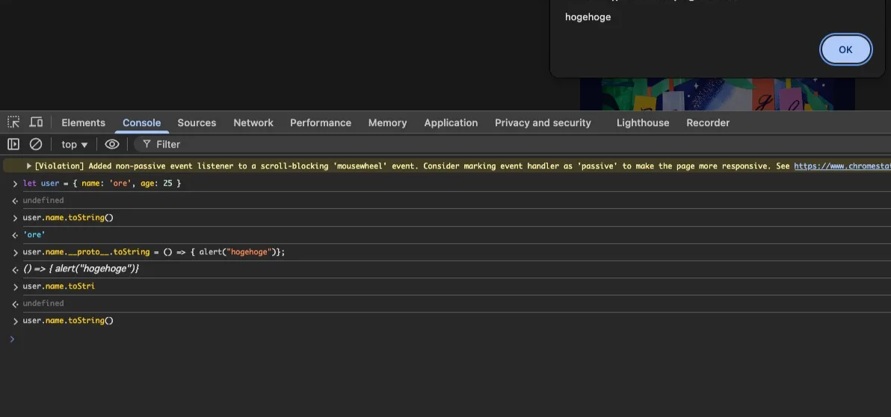

# この記事について

前回の[JavaScriptとプロトタイプベース](/2052b5086cb780b6aebcfdc63d222d2a)で気になっていたプロトタイプ汚染について書く。

個人のメモ的な側面が強いです。

# プロトタイプ汚染とは何か

> プロトタイプ汚染攻撃(prototype pollution attack)とは、ざっくり言うと、攻撃者がJavaScriptオブジェクトのプロトタイプを書き換えることで、情報を盗んだり、オブジェクトの振る舞いを変更したりする攻撃のことです。

[https://qiita.com/suin/items/9c80f299057a338f77be#%E3%83%97%E3%83%AD%E3%83%88%E3%82%BF%E3%82%A4%E3%83%97%E6%B1%9A%E6%9F%93%E6%94%BB%E6%92%83%E3%81%A8%E3%81%AF](https://qiita.com/suin/items/9c80f299057a338f77be#%E3%83%97%E3%83%AD%E3%83%88%E3%82%BF%E3%82%A4%E3%83%97%E6%B1%9A%E6%9F%93%E6%94%BB%E6%92%83%E3%81%A8%E3%81%AF)

プロトタイプを書き換えるということがまずなんなのか、については以下の動画を参考に実行してみてわかった。

[https://www.youtube.com/shorts/HzedAeTppHI](https://www.youtube.com/shorts/HzedAeTppHI)



このように、 `toString()` を実行すると、ブラウザによってアラートが表示されてしまうようになった。これは `toString` に対して期待する動きでは全くないし、文字通り動作が汚染されてしまったと言える。

JavaScriptでは、Object.prototypeを親として全オブジェクトが継承している。

つまり、このObjectをにあるプロパティを操作されると、現在のアプリケーション上にある全てのオブジェクトが汚染されてしまうのだろうか？

これについてはChatGPT(o3) に聞いてみるといい感じの答えをもらった。

```plain text
質問文
いま、JavaScriptとプロトタイプ汚染について深掘りしています。

> この「親」を攻撃者が書き換えると、新規・既存を問わずすべてのオブジェクトに悪意のプロパティが現れます


つまり、今ブラウザ上で動いている全てのJavaScriptのオブジェクトに対して影響を与えるということですか？
もしそうであれば、かなり注意しなければいけない欠陥であると考えています。
```

### 回答
### **プロトタイプ汚染で「本当にすべてのオブジェクトが汚染されるのか？」**

結論から言うと **“大半のユーザー定義オブジェクトには影響するが、ブラウザ上の すべて が一律に汚染されるわけではありません”**。

影響範囲は次の 3 点で決まります。

| **影響するか** | **ポイント** | **具体例** |
| --- | --- | --- |
| **◎ 影響大** | 既定では **Object.prototype を継承**する普通のリテラル ({}) や new Foo() で作ったオブジェクト | アプリ側で扱う設定オブジェクト、JSON から merge したデータなど |
| **○ 条件付き** | ブラウザや Node が生成する **ラッパー系ビルトイン**（Array・Date など）は内部実装によってはプロトタイプを固定されているが、上書きしたプロパティに“影”がさす場合がある | 配列操作ライブラリが外部入力で上書きされた length 風プロパティを誤用…など |
| **✕ 影響なし** | - Object.create(null) で作った **null プロトタイプ**オブジェクト- 大半の **DOM/ブラウザホストオブジェクト**（実装側で独自プロトタイプを持ち、JS から書き換え不可）- **プリミティブ値**（文字列・数値など） | const dict = Object.create(null); は汚染を受けない／document.createElement() が持つ内部スロットは操作できない |

---

### **なぜ「全部」ではないのか**

1. **ホストオブジェクトはエンジンがガード**
DOM ノードや window などは内部的に “ハードコードされた” プロトタイプを持ち、Object.prototype 直下にはぶら下がっていません。また外部から __proto__ で差し替えることも禁止されています。
2. **null プロトタイプで回避可能**
汚染が問題になる設定オブジェクトは、Object.create(null) のディクショナリ構造にすればチェーンの外に出せます（ハッシュテーブルとしても高速）。
3. **コードがプロトタイプを信用するかどうか**
実害が発生するのは *「存在するだけ」でなく、アプリがそのプロパティを信じて参照したとき*。
    - if (obj.isAdmin) … のような判定
    - for ... in で自前の hasOwnProperty チェックを省いた列挙
    - Object.assign などで更に他のオブジェクトへコピー
こうしたロジックの有無で危険度は変わります。

---

### **ブラウザと Node.js でリスクが異なる**

| **実行環境** | **攻撃面** | **傾向** |
| --- | --- | --- |
| **ブラウザ** | - 同一オリジン制約のおかげで *外部サイト* から直接 JSON を流し込まれるケースは限定的- ただし XSS や拡張機能経由で汚染されうる | 「DOM 汚染 → XSS」と組み合わせた複合攻撃が主 |
| **Node.js** | - API サーバで **req.body を merge** するパターンが多く、外部入力が直結- 汚染したプロパティを child_process.exec 等に流し込むと RCE | サーバ側で重大度の高いインシデントが相次ぐ理由 |

---

### **実務で取るべき対策（おさらい）**

4. **マージ系ライブラリを最新版に**
lodash >= 4.17.11、jQuery >= 3.4.0 など。
5. **null プロトタイプを使う辞書**

```plain text
const payload = Object.create(null); // 汚染を受けない
```

6. **hasOwnProperty or Object.hasOwn() で自己所有チェック**
7. **Node 18+ 実験フラグ --disable-proto=delete** で __proto__ 書き換え自体を禁止する選択肢。
8. **SCA (npm-audit / Snyk) を CI に組み込む**

---

> 要するに

- “プロトタイプ汚染＝ブラウザ中のものが全部やられる” ではない
- しかし **アプリが持つビジネスロジックのコアデータ** はほぼ {} オブジェクトで表現されるため影響は甚大
- 汚染を起こす脆弱性は「入力バリデーション＋安全 API」でかなり減らせる

「全オブジェクトが影響」ほど絶望的ではありませんが、アプリの重要データ構造を守る意味で **非常に注意すべき欠陥** である、というご認識は間違いありません。


回答より気になった点

> DOM ノードや window などは内部的に “ハードコードされた” プロトタイプを持ち、Object.prototype 直下にはぶら下がっていません。また外部から __proto__ で差し替えることも禁止されています。

こちらは調べると長くなりそうだったので、「JavaScriptとwindowオブジェクト」といった形で別に切り出そうと思う。

# Object.create(null) について

ここで気になったことはさまざまだが、 ひとつ `Object.crate(null)` がなんなのかについては掘り下げてみたい。

Object.createメソッドとは

> `**Object.create()**` 静的メソッドは、既存のオブジェクトを新しく生成されるオブジェクトのプロトタイプとして使用して、新しいオブジェクトを生成します。

[https://developer.mozilla.org/ja/docs/Web/JavaScript/Reference/Global_Objects/Object/create](https://developer.mozilla.org/ja/docs/Web/JavaScript/Reference/Global_Objects/Object/create)

引数に渡したオブジェクトに対して、以下のように新しいオブジェクト `john` を作成できる。

`john` オブジェクトは `person` で定義したgreetを、Object.createの戻り値として受け取ることによって、同じように使用することができている。（personというオブジェクトをprototypeとして使用している、とは画像の通りで、greetはプロトタイプチェーンの仕組みに乗っ取って実行されている）

```javascript
const person = {
  greet: function() {
    console.log(`Hello, my name is ${this.name}`);
  }
};

const john = Object.create(person);
john.name = 'John Doe';
john.greet(); // Hello, my name is John Doe
```

johnの中身を見てみると、 内部スロット `[[prototype]]` にgreetが存在しているのがわかる。


[https://ja.wikibooks.org/wiki/JavaScript/Object/create](https://ja.wikibooks.org/wiki/JavaScript/Object/create)

> `Object`はすべてのオブジェクトの親になるオブジェクトであると言いましたが、例外もあります。

> イディオム（慣習的な書き方）ですが、`Object.create(null)`とすることで`Object.prototype`を継承しないオブジェクトを作成できます。 これにより、プロパティやメソッドをまったく持たない本当に**空のオブジェクト**を作れます。

[https://jsprimer.net/basic/prototype-object/#not-inherit-object](https://jsprimer.net/basic/prototype-object/#not-inherit-object)

実際に `Object.create(null)` をすることで何が違うのかを確かめてみた。


さっきのobject.createで作成した `john` オブジェクトだったり、上記の `me` オブジェクトは toStringというオブジェクトを必ず（特別に定義しなくとも）持っている。

しかし、 `Object.create(null)` で作成した `obj` には、toString()というメソッドは備わっていない。プロトタイプチェーンでも辿れないため、undefinedとなっている。

これがつまり、「プロパティやメソッドを全く持たない空のオブジェクトを作る」ということである。

# プロトタイプオブジェクトについて

プロトタイプオブジェクトの変更を行うことはMDNにおいては非推奨の扱いである。

> 他にも **proto** への setter/getter と同様の機能である Object.setPrototypeOf/getPrototypeOf も規定されました。しかし、MDNではプロトタイプオブジェクトを変更することは基本非推奨の扱いです。今のNode.js環境では、もちろんどちらも使えます。

[https://jovi0608.hatenablog.com/entry/2018/10/19/083725](https://jovi0608.hatenablog.com/entry/2018/10/19/083725)

prototypeを動的にいじるのは何が問題なのかについて、ChatGPT(o3)に聞いてみました。

### 回答
### **なぜ “prototype を動的にいじる” のは非推奨なのか**

代表的な 3 つの理由と、それを明言している一次情報を示します。

| **カテゴリ** | **要点** | **典型的操作** | **明文化している文献** |
| --- | --- | --- | --- |
| **① パフォーマンス劣化** | JIT が最適化済みのプロトタイプ連鎖を **全て再コンパイル**するため非常に遅い。影響は setPrototypeOf を呼んだ瞬間だけでなく、そのチェーンをたどる**あらゆるコードに波及**する。 | Object.setPrototypeOf(obj, proto) obj.__proto__ = … | MDN *Object.setPrototypeOf()* —「現代エンジンではきわめて遅い操作で、変更の余波は広範囲に及ぶ」   / MDN *Inheritance and the prototype chain* —「実行時に変更するとエンジン最適化を崩す」 |
| **② 保守性・衝突リスク** | - ライブラリ同士が **同じ組み込み Prototype に別実装を上書き**して衝突- instanceof や列挙結果が途中で変わり**バグを誘発** | Array.prototype.foo = … Date.prototype.toJSON = … | Stack Overflow「なぜプロトタイプ拡張は嫌われるか」—「複数ライブラリが同じメソッドを追加して壊れる」 |
| **③ セキュリティ (Prototype Pollution)** | 外部入力に {"__proto__": {isAdmin:true}} を混ぜると **Object.prototype が上書き**され、アプリ全体で obj.isAdmin が真になる etc. — 認可回避・RCE へ連鎖。 | merge(userInput, targetObj) のような深いマージ | PortSwigger *What is prototype pollution?* —「攻撃者がグローバル Prototype に任意プロパティを追加でき、以降すべてのユーザー定義オブジェクトが継承してしまう」 |

---

### **どうしても Prototype を操作したい場面があるなら**

- **生成時に決定**：Object.create(proto) や class extends であらかじめリンクを張る
（MDN も「変更より生成時設定の方が最適化しやすい」と勧告）。
- **null-prototype 辞書**：設定データなどは Object.create(null) で汚染経路を遮断。
- **ライブラリアップデート**：lodash >= 4.17.11、jQuery >= 3.4.0 など、汚染対策パッチ済み版を使用。

> まとめ

> Prototype に後から手を入れる行為公式ドキュメント・セキュリティ機関ともに**“できるだけ避けよ”**


# 実際の攻撃手法

[https://wg1.isog-j.org/newtechtestdoc/docs/prototype_pollution/](https://wg1.isog-j.org/newtechtestdoc/docs/prototype_pollution/)


## getPrototypeとは

> 他にも **proto** への setter/getter と同様の機能である Object.setPrototypeOf/getPrototypeOf も規定されました。しかし、MDNではプロトタイプオブジェクトを変更することは基本非推奨の扱いです。今のNode.js環境では、もちろんどちらも使えます。

[https://jovi0608.hatenablog.com/entry/2018/10/19/083725](https://jovi0608.hatenablog.com/entry/2018/10/19/083725)

> 日本語の情報としては[Node.jsにおけるプロトタイプ汚染攻撃とは何か - ぼちぼち日記](https://jovi0608.hatenablog.com/entry/2018/10/19/083725)が詳しいですが、まず、前提として、JavaScriptは「[プロトタイプベースのオブジェクト指向](https://ja.wikipedia.org/wiki/%E3%83%97%E3%83%AD%E3%83%88%E3%82%BF%E3%82%A4%E3%83%97%E3%83%99%E3%83%BC%E3%82%B9)」を採用しており、原則、すべてのプリミティブ型およびオブジェクトのインスタンスは「プロトタイプ」オブジェクトを参照しています
> また、プロトタイプ・オブジェクト自身も別のプロトタイプ・オブジェクトを参照しており、これにより、「クラスベース」のオブジェクト指向でいうところの継承関係を表しています。
> 
> プロトタイプのメンバーには、インスタンス・メソッド、クラス・メソッド、クラス・プロパティーに相当するものが存在します。
> 
> 最終的にすべてのインスタンスは継承のrootである「Object」のプロトタイプを参照します。

[https://qiita.com/shellyln/items/af200a1953991de1698d](https://qiita.com/shellyln/items/af200a1953991de1698d)

# プロトタイプ汚染以外で気にしておくべきなセキュリティ

**正規表現の脆弱性 (ReDoS) **

[https://nmi.jp/2022-02-18-Understanding-ReDoS](https://nmi.jp/2022-02-18-Understanding-ReDoS)


# 参考

[https://jovi0608.hatenablog.com/entry/2018/10/19/083725](https://jovi0608.hatenablog.com/entry/2018/10/19/083725)

[https://zenn.dev/pixiv/articles/2f6511742d7907](https://zenn.dev/pixiv/articles/2f6511742d7907)

[https://zenn.dev/canalun/articles/domdomtimes_get_prototype_from_iframe#%E8%A3%9C%E8%B6%B3%3A-%E6%B1%9A%E6%9F%93%E3%81%95%E3%82%8C%E3%81%A6%E3%81%84%E3%82%8B%E3%81%8B%E3%81%AE%E5%88%A4%E5%AE%9A](https://zenn.dev/canalun/articles/domdomtimes_get_prototype_from_iframe#%E8%A3%9C%E8%B6%B3%3A-%E6%B1%9A%E6%9F%93%E3%81%95%E3%82%8C%E3%81%A6%E3%81%84%E3%82%8B%E3%81%8B%E3%81%AE%E5%88%A4%E5%AE%9A)

[https://jsprimer.net/basic/prototype-object/#not-inherit-object](https://jsprimer.net/basic/prototype-object/#not-inherit-object)

OWASP

> OWASP - Open Worldwide Application Security Project とは、Webをはじめとするソフトウェアのセキュリティ環境の現状、またセキュアなソフトウェア開発を促進する技術・プロセスに関する情報共有と普及啓発を目的としたプロフェッショナルの集まる、オープンソース・ソフトウェアコミュニティです。The OWASP Foundationは、NPO団体として全世界のOWASPの活動を支えています。

[https://owasp.org/www-chapter-japan/](https://owasp.org/www-chapter-japan/)

OWASP Cheat Sheet Series

[https://cheatsheetseries.owasp.org/cheatsheets/Prototype_Pollution_Prevention_Cheat_Sheet.html?utm_source=chatgpt.com](https://cheatsheetseries.owasp.org/cheatsheets/Prototype_Pollution_Prevention_Cheat_Sheet.html?utm_source=chatgpt.com)

[https://zenn.dev/maronn/articles/read-hash-in-owasp](https://zenn.dev/maronn/articles/read-hash-in-owasp)

[https://www.mitsue.co.jp/knowledge/blog/frontend/201804/24_1413.html](https://www.mitsue.co.jp/knowledge/blog/frontend/201804/24_1413.html)

prototype汚染とproposalとわたしたちと([meguro.es](http://meguro.es/) #26)

[https://docs.google.com/presentation/d/10nW95bjXKhlWhGO26f5XfTuQ2DALTQZz/edit?slide=id.p1#slide=id.p1](https://docs.google.com/presentation/d/10nW95bjXKhlWhGO26f5XfTuQ2DALTQZz/edit?slide=id.p1#slide=id.p1)
