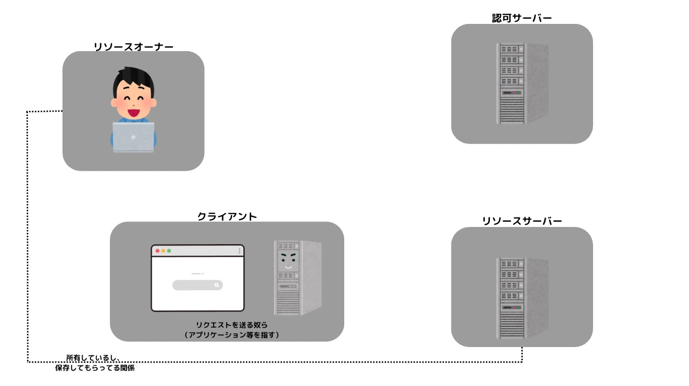

## 初めに

認証関連について関わると、必ずお目にかかるのがOAuthやOpenID Connectといった言葉です。

今回はこれらの言葉について概要をまとめつつ、何が違うのかを自分の理解を深めていきながら記載していきます。

長くなりそうだったのでOpenID Connectに関しては別の記事にします。

## 認証と認可

まずOAuthやOpenID Connectを理解するにあたって避けては通れない概念である「認証」と「認可」について、それぞれ記述していきます。

### 認証（Authentication）

「認証」とは、対象が「誰」であるかを確認することです。

言い換えれば**「利用者の本人確認を行うこと」**となります。

サービスを利用するとき、IDとパスワードを使って、サービスに対してログインします。

この時、サービスはあらかじめユーザーによって登録されたIDとパスワードを入力内容と照合し、ログインしようとしているユーザーが「誰」かを確認しています。

認証を行う仕組みとして、現在は以下の3つが代表的なものです。

- 知識要素
（具体例）
    - パスワード
    - PINコード
    - 秘密の質問
- 所持要素
（具体例）
    - モバイル端末のSMS認証
    - デジタルIDカード
    - セキュリティトークン
- 生体要素
（具体例）
    - 顔認証
    - 指紋認証

Webサイトへのリクエスト時に「認証エラー」となった場合は、ステータスコードとして**「401 Unauthorized」**が返却されます。

※ Unauthorizedは「権限のない」「無許可の」という意味

[https://developer.mozilla.org/ja/docs/Web/HTTP/Status/401](https://developer.mozilla.org/ja/docs/Web/HTTP/Status/401)

※ 補足

ここで「Unauthorized」で検索すると「認**可**されていない」などという日本語が出てきます。これを引きずると認証と認可の理解が非常にややこしくなります（ソースは自分）

なので「認証・認可」の世界での「認可」と、和訳として出てくる「認可」は別のものとして認識することをおすすめします。

### 認可（Authorization）

対象物（リソース）に対して、アクセスする権限を与えるものです。

ネット上でよく見る現実世界に例えた例としては、「駅で切符を買うことで、電車に乗ることができる」というようなものです。

この「電車に乗る」という行為は、「切符を買った人が誰」であるのかは関係がありません。

「ユーザーの権限によって見れるページが異なる」という場合、それぞれの権限に基づいた「認可」が行われているということになります。

Webサイトへのリクエスト時に「認可エラー」となった場合は、ステータスコードとして**「403 Forbidden」**が返却されます。

※ Forbiddenとは「禁断」や「禁じられた」という意味

[https://developer.mozilla.org/ja/docs/Web/HTTP/Status/403](https://developer.mozilla.org/ja/docs/Web/HTTP/Status/403)

### 認証と認可は全く別々の仕組み

認証と認可はごっちゃにしてしまいがちですが、実際は全く異なったプロセスです。

Webアプリケーションにおいて、基本的にはこれらは組み合わせて扱われます。

以下に「認証」だけの場合、「認可」だけの場合で考えてみます。

「認証」だけの場合

ログインしたすべてのユーザーが、アプリケーションに対してあらゆる権限を持っているということになります。SNSで例えると、ユーザーAがユーザーBの投稿を行えてしまう、といったカオスな状況です。なので認証だけ、というシチュエーションは基本的になく、認可と組み合わせて使われます。

「認可」だけの場合

こちらの場合はあり得ます。特定のIPアドレスからのリクエストを許可する、というのも認証に基づかない認可です。先ほどの切符の例のように、IPアドレスが「誰か」を特定することはないからです。

## OAuthとはなにか

OAuthはOpen Authorizationの略で、**「認可（Authorization）」**を行うためのプロトコルです。

もう少し踏み込んでいうと、アクセストークンを使用して、異なるシステムのデータや機能に対するアクセス権限の許可を行うことができる仕組みです。

2007年にTwitterのBlaine Cook氏らが草案を発表し、2010年4月に[RFC 5849](https://tex2e.github.io/rfc-translater/html/rfc5849.html)として公開されました。

現在はRFC 5849の仕様は廃止され、2012年10月にOAuth 2.0として[RFC 6749](https://tex2e.github.io/rfc-translater/html/rfc6749.html)が公開されています。

[OAuth2.0は次世代のOAuthプロトコルであり、1.0とは後方互換性を持ちません。](https://ja.wikipedia.org/wiki/OAuth#OAuth_2.0)

現代でOAuthと言うのであれば、基本的にはOAuth2.0のことを指していると考えていいでしょう。

※ 補足

OAuth 2.0が現時点（2023年）の今でも言葉として使われているのは流石に違和感があったので、「OAuth3.0はないんかい！」となりましたが**存在しない**みたいです。

[https://oauth.net/3/](https://oauth.net/3/)

> OAuth 3.0 does not exist. Over the years, even as early as 2012 when OAuth 2.0 was published, several efforts have attempted to evolve and build upon OAuth 2.0. However, as of August 2023, there is no spec officially called OAuth 3.

和訳（DeepL）

> OAuth 3.0は存在しない。2012年にOAuth 2.0が発表された当初から、何年もの間、OAuth 2.0をベースに進化させようとする試みが行われてきました。しかし、2023年8月現在、正式にOAuth 3と呼ばれる仕様は存在しません。

OAuthからの流れと同じく後方互換性はないですが実質的なOAuth3.0として「GNAP」というものがあったみたいです。あんまり新しい情報が見当たらないなーと思ってIETFのページを見に行ったら、期限切れドラフトになっていました。広がらなかったのかな…？

### OAuthの仕組み

OAuthについて理解するにあたって必要な登場人物は以下の4つです。

- リソースオーナー
- 認可サーバー
- クライアント
- リソースサーバー

早速ですが、それぞれを図にして表してみました。

**リソースオーナー**

実際にデータを所有する人（オーナー）です。この人はリソースサーバーに自分のデータ（Googleカレンダーに記録した自分のスケジュールの情報など）を保有しています。リソースサーバーについては後述しますが、Googleのいろんなアプリケーションのデータだったり、Amazon Photoに保存している画像の情報だったりと様々です。

**認可サーバー**

その名の通り「認可」を行うサーバーです。

リソースオーナーの許可に基付き、クライアントに対しての認可コードの発行や、リソースサーバーへアクセスし情報を取得するためのアクセストークンを発行します。

**クライアント**

「Webアプリケーション」だったり「スマートフォンのアプリケーション」だったりと様々です。サードパーティーアプリケーションとも言われています。これらはOAuthの世界では「クライアント（OAutnクライアント）」と呼ばれています。

**リソースサーバー**

これもその名の通り、「リソース」を保存しているサーバーです。「リソース」とはオーナーが保有しているもの（Google Driveにある画像ファイルやスプレッドシート）などのデータそのものです。

以上から「リソースオーナー」が自分と関係ない（ただ利用しているだけの）アプリケーションに対して、「この情報だったら見ていいよ〜」という許可を与えるために「認可サーバー」という代理人からアクセストークンという切符を発行して許可を与えます。

そして、全然パスワードとか管理していないクライアントがアクセストークンをリソースサーバーに提示します。アクセストークンを検証したリソースサーバーは、検証がOKであればリソースをクライアント側に提示する。という仕組みがOAuthの概観です。

以下がやりとりの代表的なイメージ図です。

上の図はかなーりざっくりとしたもので、厳密にはフローによっていろいろと異なります。

## OAuth2.0のフロー

Oauth2.0では4つのフローが[RFC 6749](https://tex2e.github.io/rfc-translater/html/rfc6749.html)で定義されています。

- 認可コードフロー
- インプリシットフロー
- リソースオーナー・パスワード・クレデンシャルフロー
- クライアント・クレデンシャルズフロー

また、認可サーバーでは以下のように2つのエンドポイントが用意されており、各フローによってどのエンドポイントを使用するのかが異なります。

認可サーバーが提供する2つのエンドポイント

以下に、それぞれのフローについての特徴を記述していきます。

### **1. Authorization Code Flow（認可コードフロー）**

認可リクエスト時に送信するresponse_typeというパラメーターが「code」であった場合、このフローとなります。ざっと、以下のようなフローでアクセストークンが発行されます。

1. クライアントがサービスのリソースサーバーにアクセスしても良いか確認する
2. ユーザーの許可を得たクライアントが認可エンドポイントにリクエスト
3. クライアントに「認可画面」を返し、ユーザーに表示する
4. クライアントが要求している権限をユーザーが確認。IDとパスワードを入力し認可リクエストを許可する
5. 認可サーバーはクライアントに「認可コード」を発行
6. クライアントから認可サーバーのトークンエンドポイントにリクエストを送信する
7. 認可サーバーのトークンエンドポイントはアクセストークンを返却する
8. アクセストークンを受け取ったクライアントは、リソースサーバーに対してアクセストークンを提示する
9. クライアントがリソースを受け取る

この認可コードフローが現在OAuthでは一般的で、基本形として扱われています。

### **2. Implicit Flow（インプリシットフロー）**

認可サーバーリクエスト時のresponse_typeが「token」だった場合はこのフローとなります。

基本的にはWebブラウザの中で動くアプリが使うために用意されています。ただ、最近はWebブラウザで動くアプリも認可コードフローを採用しましょう、という話になっており、現代での使用は推奨されていません。

※ そのためフローについては省略します

### **3. Resource Owner Password Credentials Flow（リソース・オーナー・パスワード・クレデンシャルズフロー）**

こちらについては現時点では**使ってはいけないフロー**と言われています。

具体的な手順は以下です。

10. クライアントがユーザーに対してリソースサーバーにアクセスしても良いか確認
11. クライアントはユーザーにIDとパスワードを入力してもらうための画面を表示
12. ID、パスワードの入力を受け取ったクライアントが、認可サーバーのトークンエンドポイントにリクエストを送信する
13. 認可サーバーはアクセストークンを発行する
14. クライアントはアクセストークンをリソースサーバーに提示して、リソースを受け取る

このフローでは「認可サーバー」ではなく「クライアント」がユーザーにID、パスワードを聞くことがポイントです。この**クライアント**が悪いアプリ等だった場合、ユーザーのパスワード情報を盗み出すことが可能になってしまいます。

具体的に、なぜこんなフローが定義されているか、については以下で解説されているのでこちらを参考にしていただければと思います。

[https://qiita.com/TakahikoKawasaki/items/f2a0d25a4f05790b3baa#resource-owner-password-credentials-grant-について](https://qiita.com/TakahikoKawasaki/items/f2a0d25a4f05790b3baa#resource-owner-password-credentials-grant-について)

### **4. Client Credentials Flow**

こちらはユーザー自身は関与せず、クライアントがトークンエンドポイントにアクセストークン取得のリクエストを投げるフローです。

ここではクライアントIDとクライアントシークレットなどを用いて、トークンエンドポイントにリクエストを送信し、アクセストークンが発行されます。

ここでのアクセストークンはユーザーが絡んでいないので、ユーザーの情報はもちろん紐づいていません。あくまで「クライアントが誰ですよ」という情報しかないアクセストークンです。

なのでこのフローにおいては、ユーザーの確認画面等は存在せず、アプリとAPI間の通信等で用いられます。

## まとめ

認証と認可の違いをまず理解することがあまりできていなかったため、OAuthと聞いてもぼんやり「こんなイメージのやつやな」としか思えていませんでした。

改めていうと、OAuthは「認可」の仕組みのため、認証に使おうとするとえらいことになります。

「認可」は誰であるかを証明しないので、クライアントが悪いアプリだった場合、アクセストークンを入手されたらなりすましが可能になります（切符で言うと、発行された切符を全然違う悪い人が受け取っちゃったり。その人はまんまと電車に乗れたりできてしまう）

以下がそれを説明した記事ですね。

[https://www.sakimura.org/2012/02/1487/](https://www.sakimura.org/2012/02/1487/)

そんな「認可」の仕組みであるOAuthを拡張し、IDトークンという「誰であるか」の認証の部分も担うようにする仕様がOpenID Connectというものですが、今回は一旦この辺りで。

## 参考

[https://zenn.dev/ken3pei/articles/96d64c11aea4e8](https://zenn.dev/ken3pei/articles/96d64c11aea4e8)

[https://ritou.hatenablog.com/entry/20130718/1374107391](https://ritou.hatenablog.com/entry/20130718/1374107391)

[https://www.slideshare.net/tkudo/openid-connect-devlove](https://www.slideshare.net/tkudo/openid-connect-devlove)

[https://atmarkit.itmedia.co.jp/fsmart/articles/oauth2/01.html](https://atmarkit.itmedia.co.jp/fsmart/articles/oauth2/01.html)

[https://www.sailpoint.com/ja/identity-library/what-is-the-difference-between-authentication-and-authorization/](https://www.sailpoint.com/ja/identity-library/what-is-the-difference-between-authentication-and-authorization/)

[https://dev.classmethod.jp/articles/authentication-and-authorization/#return-note-184783-1](https://dev.classmethod.jp/articles/authentication-and-authorization/#return-note-184783-1)

[https://logmi.jp/tech/articles/322829](https://logmi.jp/tech/articles/322829)