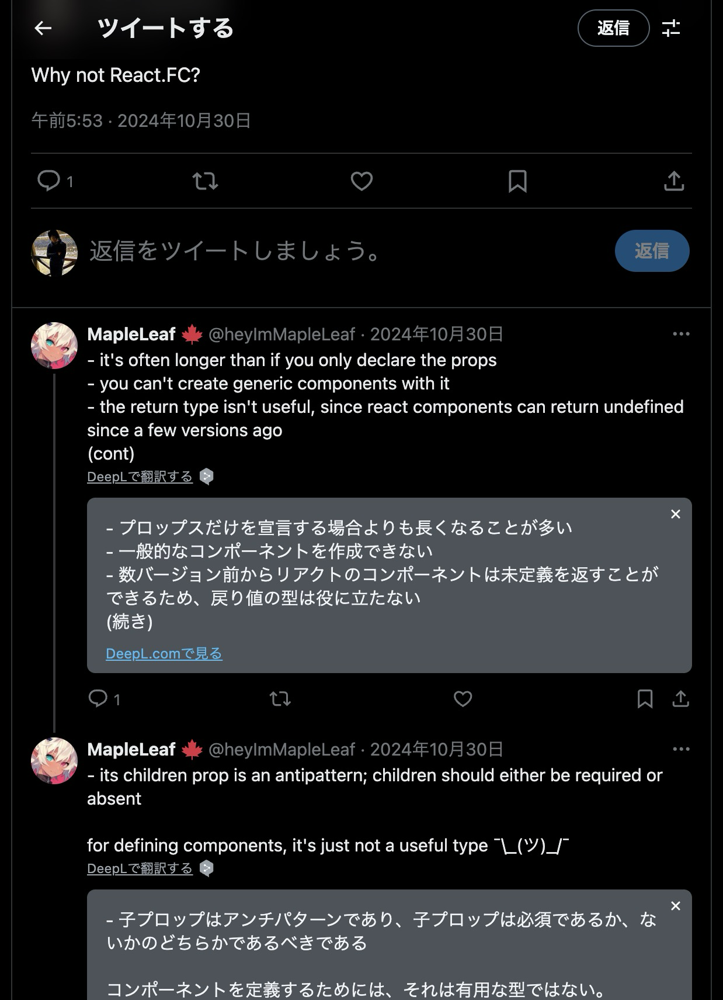

個人的な備忘録

## React.FCに対するいろんな人の主張

## React.FC使う派の人たちの意見

> 1つの型だけでReactコンポーネントであることが確定できるからです。
> Reactコンポーネントは、ただ一つのオブジェクト型引数(つまりProps)とReact要素妥当なJSXや文字列、数値などを戻り値とする関数です。型と戻り値がセットで一致して初めてReactコンポーネントとして認められます。
> 
> 引数と戻り値の型を2つセットで定義する必要がある以上、それを同時に宣言できる`React.FC`はお誂え向きと言えます。通常の関数型宣言ではどちらかを間違えてしまうかもしれません。

[https://blog.stin.ink/articles/i-do-use-react-fc-type](https://blog.stin.ink/articles/i-do-use-react-fc-type)

> 何故かこれ系のほかの記事でも言及されていないことが多いのですが、`FC` を使う最大の実用上の理由は「`FC` に**返り値**の型チェックがあるから」です。コンポーネントとは props を受け取るだけではダメで、`ReactNode` を return して初めてコンポーネントです。`FC` はそのチェックを行います。

[https://zenn.dev/link/comments/f45c5f39605259](https://zenn.dev/link/comments/f45c5f39605259)

## JSX.Elementのdeparecatedについて

[https://github.com/DefinitelyTyped/DefinitelyTyped/blob/266eae5148c535e6b41fe5d0adb2ad23f302bc8a/types/react/index.d.ts#L3391](https://github.com/DefinitelyTyped/DefinitelyTyped/blob/266eae5148c535e6b41fe5d0adb2ad23f302bc8a/types/react/index.d.ts#L3391)

> DefinitelyTypedは、あらゆるJavaScript製ライブラリに対するTypeScriptの型定義をメンテナンスしているリポジトリです。
> まだ、TypeScriptとFlowのどちらを使うか？という選択肢の間でJavaScriptを使う開発者たちが揺れ動いていた、TypeScript黎明期を支えた偉大なプロジェクトです。

[https://zenn.dev/syumai/articles/cso16sv24dtqr6u27ajg](https://zenn.dev/syumai/articles/cso16sv24dtqr6u27ajg)

[https://github.com/DefinitelyTyped/DefinitelyTyped/blob/master/README.ja.md](https://github.com/DefinitelyTyped/DefinitelyTyped/blob/master/README.ja.md)

## functionかarrow functionか

arrow functionであればreturnは省略できる

> 前者で書いた時に State や関数を足したくなった時に書き換えなければいけない部分が増えるからです。それなら最初から全部書いておけば？というのが個人的な感想です。

returnは明示的にした方がまあ、わかりやすい

[https://zenn.dev/seya/articles/0317b7a61ee781#const-%E3%81%AE-return-%E3%81%AE%E9%83%A8%E5%88%86%E3%82%92%E5%8F%AF%E8%83%BD%E3%81%AA%E6%99%82%E3%81%AB%E7%9C%81%E7%95%A5%E3%81%99%E3%82%8B%E3%81%8B](https://zenn.dev/seya/articles/0317b7a61ee781#const-%E3%81%AE-return-%E3%81%AE%E9%83%A8%E5%88%86%E3%82%92%E5%8F%AF%E8%83%BD%E3%81%AA%E6%99%82%E3%81%AB%E7%9C%81%E7%95%A5%E3%81%99%E3%82%8B%E3%81%8B)

関数宣言でコンポーネントを定義するメリットは、Hoistingが効くこと

[https://dev.to/ugglr/react-functional-components-const-vs-function-2kj9](https://dev.to/ugglr/react-functional-components-const-vs-function-2kj9)

