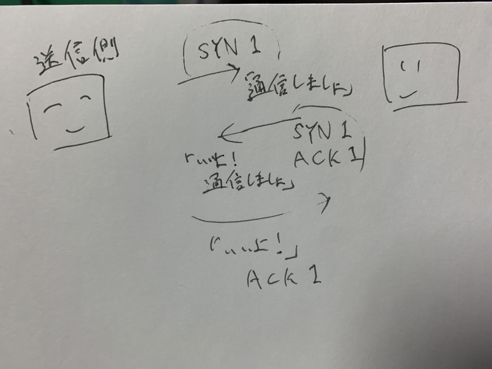
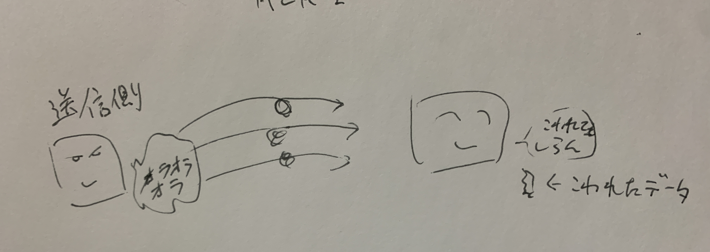

基礎的な知識を体系的にまとめていくシリーズです。

情報系の学校に行っていたわけでもない、基本情報技術者も持っていない文系3年目エンジニアが、業務から覚えたフワッとした知識をしっかり固めていくための取り組みです。

この記事ではTCP/IPについてフォーカスを当てつつ、周辺に関わる単語群や概念について一つずつまとめていきます。

# TCP/IPとは

Transmission Control Protocol / Internet Protocolの略称。

インターネットにおいて標準的に用いられているプロトコル（約束事）のことを指します。

元々は1970年代、ARPA (Advanced Research Projects Agency) の主導で開発されたインターネットの前進となる大規模ネットワーク (ARPANET) 上で、様々な大型計算機同士の通信のためのプロトコルが検討されていました。ここで用いられるようになったのが「パケット通信」と呼ばれる手法です。このパケット通信のために検討されたプロトコルが TCP/IPであり、現在では標準的に使われる技術となっています。

TCP/IPの技術仕様については、公開文書であるRFCにまとめられています。

全体の概要としてまとめられているのは以下のRFC1122です。

[https://datatracker.ietf.org/doc/html/rfc1122](https://datatracker.ietf.org/doc/html/rfc1122)

日本語訳

[https://jprs.jp/tech/material/rfc/RFC1122-ja.txt](https://jprs.jp/tech/material/rfc/RFC1122-ja.txt)


## インターネットプロトコルスイート

RFC1122の1.1.3には、「インターネットプロトコルスイート」という項目で、以下のように述べられています。

> インターネットシステムを使用して通信を行うため、ホストはインター
ネットプロトコルスイートを構成する階層化されたプロトコル一式
を実装しなければならない。典型的な場合、ホストは各レイヤーで
少なくとも一つのプロトコルを実装しなければならない。

それらのレイヤーを、下記のように定義しています。

- アプリケーションレイヤー
- トランスポートレイヤー
- インターネットレイヤー
- リンクレイヤー

各レイヤー（層）の詳細については後述します。

これらはインターネットの通信に必要な各プロトコル群について表しており、現在における「インターネットプロトコルスイート」という言葉そのものはTCP/IPを指していることがほとんどです。

ところで表題の一部にある「プロトコルスイート」とは何でしょうか、ということを一旦以下にメモとして記していきます。

### 「プロトコルスイート」とは

通信するときに必要な複数のプロトコル（約束事）をひとまとめにしたものを表す言葉です。

例として、TCP/IPはデータ転送の信頼性を確保するTCPと、ネットワーク間の通信を可能にするIP、HyperTextを送受信するためのHTTPなど、多数のプロトコルが含まれているため、TCP/IPプロトコルスイートなどと呼ばれることもあります。

### 「プロトコルスタック」とは

通信を行うために必要なプロトコルが階層構造を形成しているが概念のことです。

それぞれのプロトコルが特定のレイヤーに位置し、各レイヤーは特定の役割を果たします。

低レイヤー（物理的な通信）から高いレイヤー（アプリケーション間の通信）に向かって、具体的な通信の詳細から抽象的な通信の概念に移行します。

プロトコルスイートとプロトコルスタックについての参考

[https://note.com/sukyojuku/n/n3982eba5114b](https://note.com/sukyojuku/n/n3982eba5114b)

# OSI参照モデルについて

よくTCP/IPの比較対象のような図で、「OSI参照モデル」という概念も出てきます。

結論から言うと現在、このOSI参照モデルは実際には利用されていないようです。

じゃあ何でこんなものがあるねんというと、以下のような理由があるようでした。

- 昔々のネットワークの通信方式は世界中でバラバラだった
- 1982年、ISO（国際標準化機構）とITU（国際電気通信連合）により、OSI (Open System Interconnection: 開放型システム間相互接続）というネットワーク標準規格の策定が始められる
- このOSIで用いられる通信のモデルがOSI参照モデルとなる。すべてのネットワーク機器に採用されることを目標に開発が進められる
- OSIが不必要に複雑であったことなどが原因となり、当時別方面から勢力を広げていたTCP/IPが広く普及し、実質的な世界的標準として扱われるようになる

しかし、実際にほぼ使用されていないとはいえOSI参照モデルの考え方は現在もネットワークやプロトコルの概念、機能などの理解に役に立ち、様々なプロトコルを識別するための基準にもなるため、広く利用されているようです。

今回はTCP/IPにフォーカスを当てているため本記事での深堀りはしません。以下の参照画像の引用先に非常に詳しく記載されているので、気になる方はこちらを一読いただければと。


[https://www.itmanage.co.jp/column/osi-reference-model/#anc002](https://www.itmanage.co.jp/column/osi-reference-model/#anc002) より引用

### ちょっと追記

[https://oshiete.goo.ne.jp/qa/5891204.html](https://oshiete.goo.ne.jp/qa/5891204.html)

OSI参照モデルが実装に使われていないにもかかわらず今でも現役で何かと出てくるのは、「ネットワークを一般論として理解することに向いているアーキテクチャ」ということがいろいろ調べた中で落ち着くところかなと感じました。

けど、実際の実装とは異なる概念を「話が分かりやすい」という理屈で比較して解説するのってどうなん？ という気持ちもなきにしもあらず……

と思って調べていたら、タイトルは少し過激だけど参考になる記事がありました。

[https://zenn.dev/yojo/articles/fef558e5d4264d](https://zenn.dev/yojo/articles/fef558e5d4264d)

なんで？ という疑問はQuoraにもありました。

以下回答です。

> Great question, and one that many would agree with. In theory, we should only teach the TCP/IP model, because - let’s face it - that’s what everything is.
Look, as far as most networking people are concerned, only the first 4 OSI layers matter anyway. All the rest *is *Application. But I do like the distinction between OSI’s layers 1 & 2, which technically don’t exist in the TCP/IP model. They’re really one thing. And industry wide, most other networking people seem to agree with that too. IP is considered layer 3. Ethernet is layer 2. Wiring specs are layer 1. And consciously or not, we all pretty much agree on these things. We don’t talk about switches running at layer 1 because… well, they are layer 2 devices. But not in the TCP/IP model.
From a conceptual perspective, I think the first 4 layers are easier to understand in OSI, and for teaching new networking students, that’s important. But otherwise, you’re right.

> 素晴らしい質問だ。理論的には、私たちはTCP/IPモデルだけを教えるべきでしょう。
なぜなら、現実を直視してほしいのだが、それがすべてなのだ。多くのネットワーキング関係者が懸念しているように、とにかく重要なのは最初の4つのOSIレイヤーだけだ。残りはすべてアプリケーションだ。しかし、OSIの第1層と第2層は、技術的にはTCP/IPモデルには存在しない。これらは本当に1つのものなんだ。業界全体では、他のほとんどのネットワーク関係者もそれに同意しているようです。IPはレイヤー3と考えられている。イーサネットはレイヤー2。配線仕様はレイヤー1だ。そして、意識的であろうとなかろうと、私たちは皆、これらのことにほぼ同意している。レイヤー1で動作するスイッチの話はしませんが、それはレイヤー2のデバイスだからです。しかし、TCP/IPモデルでは違う。
概念的な観点からは、最初の4つのレイヤーはOSIの方が理解しやすいと思います。しかし、そうでなければ、あなたの言う通りだ。

[https://www.quora.com/Why-is-the-OSI-model-a-taught-subject](https://www.quora.com/Why-is-the-OSI-model-a-taught-subject)


> It’s important to understand it if you’re trying to convince somebody that you understand it; maybe you need to learn it for a class, or to write a paper about the OSI model.
In the everyday world of networking, the main remnants of the OSI model which survive today using the original OSI terminology are two terms: “layer 2” and “layer 3”.
If you just learn what “layer 2” and “layer 3” mean in modern terminology, you know most of the OSI model that’s still used heavily.

> 自分がOSIモデルを理解していることを誰かに納得してもらおうとするのであれば、それを理解することは重要である。
日常的なネットワーキングの世界では、OSIモデルの主な名残で、オリジナルのOSI用語を使って現在も残っているのは、2つの用語である：「レイヤー2」と「レイヤー3」である。
レイヤー2」と「レイヤー3」が現代用語で何を意味するのかさえ覚えれば、今でも多用されているOSIモデルの大半を知ることができる。

[https://www.quora.com/Why-is-it-important-to-understand-the-OSI-model](https://www.quora.com/Why-is-it-important-to-understand-the-OSI-model)

いろいろと調べたところ、下層のネットワークインターフェース層（リンク層）を理解する際にはOSI参照モデルの考え方を理解していることが必要そうで、それ以外は特に比較する必要はないのでは、というところでした。ただ下層だけいきなりTCP/IPとは異なる概念持ち出してもアレなので、OSI参照モデルっていう概念がありまして……という流れで基礎知識として持っておく必要があった、というところなのかな？

### ちょっとどうでもいい追記

アメリカでは比喩的な表現としてOSI8層目が問題だよ、とか言うことがあるらしい。

どういうことかというと、以下のようである。

> ネットワーク技術者が「第8層問題だよ」と言っていれば、それは「ネットワーク自体には問題は無くて、[エンドユーザ](https://www.weblio.jp/content/%E3%82%A8%E3%83%B3%E3%83%89%E3%83%A6%E3%83%BC%E3%82%B6)に問題があるんだよ」という意味である。

[https://www.weblio.jp/wkpja/content/OSI参照モデル_歴史](https://www.weblio.jp/wkpja/content/OSI%E5%8F%82%E7%85%A7%E3%83%A2%E3%83%87%E3%83%AB_%E6%AD%B4%E5%8F%B2)

ネットワーク技術者じゃないけど、なんかあったら自分も折を見て「OSI参照モデルでいう、13層目が問題なんじゃないすスか？」とか言ってみるか…（絶対くそスベるのでやらない）

# TCP/IPの各階層（レイヤー）について

先ほどの項であったOSI参照モデルは7層の構成でしたが、TCP/IPでは階層が4つとシンプルになっています。以下の図を参照しつつ、各レイヤーがどのような役割を持っているのかを見ていこうと思います。図で表現されているように、ここから下はレイヤーを「層」と記述して進めていきます。


[https://www.itmanage.co.jp/column/tcp-ip-protocol/#anc001](https://www.itmanage.co.jp/column/tcp-ip-protocol/#anc001) より引用

## アプリケーション層

アプリケーションで扱うデータのフォーマットや手順を決め、通信サービスを実現する役割を担っています。

OSI参照モデルにおける、アプリケーション層、プレゼンテーション層、セッション層の3つを統合したもので、機能としても3つの機能をすべて保持しています。

この層で扱われる主なプロトコルとして、以下が挙げられます（これ以外にもいっぱい）

- HTTP (Hypertext Transfer Protocol)
- SMTP (Simple Mail Transfer Protocol)
- POP (Post Office Protocol)
- IMAP (Internet Message Access Protocol)
- DHCP (Dynamic Host Configuration Protocol)
- FTP (File Transfer Protocol)
- DNS (Domain Name System)
- SSH (Secure Shell)

ここで列挙されるプロトコルについての詳細は、また別の記事に切り分けていければと思います（個人的にはHTTPを深堀ってみたかったり、DNSがどんなことをしているかを詳しく知りたかったり）

アプリケーション層で付与されるヘッダ情報を「アプリケーションヘッダ」といいます。アプリケーションヘッダーにはサービスを実現するために最も重要な「要求と応答」に関する情報が書き込まれます。

クライアントからやりとりを送信する際、このアプリケーションヘッダとデータをひとくくりにして、下層のトランスポート層に引き渡します（プロトコルによって渡し方は様々あり）。引き渡す際にはデータはカプセル化されているため、データがユーザーに解釈できる形になっているのはこのアプリケーション層のみです。

## トランスポート層

データを適切なアプリケーション層に振り分け、通信を実現す役割を担う層です。

transportには「運ぶ」「輸送する」という意味があるため、その名の通りの働きを行う層といえます。また、「運ぶ」ことに関して「通信相手のコンピューター」までではなく、「通信相手のアプリケーション層にあるどのプロトコルに渡すのか」までの責任を持ちます。

### TCPとUDP

トランスポート層のプロトコルには2つの重要な以下のプロトコルが存在しています。

- TCP (Transmission Control Protocol)
- UDP (User Datagram Protocol)

**TCP**

「データを安全 / 確実に届けること」をモットーにしたプロトコル。データが途中で破損したり、何らかの事情で相手に届かなかった時などには再送します。

**UDP**

「データを素早く届けること」をモットーにしているプロトコル。相手に「オラオラオラァ！」という感じでどんどんデータを送りつけます。送信しているデータが破損していようと知ったこっちゃありません。

まさに、

TCP: 通信の信頼性 > 速度

UDP: 通信の信頼性 < 速度

こんな構図ですね。

ずいぶん前（そもそもエンジニアになる前）に旧Twitterでバズっていた投稿がありましたが、非常にイメージしやすいです。


[https://x.com/dragan_security/status/1080895022504001536?s=20](https://x.com/dragan_security/status/1080895022504001536?s=20)

UDPは受け手のペースに関係なくどんどん水を出すので、結果的に高速で送信できます（ペットボトルの水もすぐなくなります）

用途としては、リアルタイム性が問われるIP電話やストリーミング配信など。これらのサービスは送信がちょっと映像が乱れたからといってまた再送するわけにはいきません。なので音楽、映像のライブ配信などのサービスはこのUDPの上に成り立っているといえるでしょう。

### アプリケーション層へのデータの受け渡し

アプリケーション層には、プロトコルごとにデータの出入り口が用意されています。

各プロトコルは**「ウェルノウンポート」**という0～1023のポート番号に振り分けられており、TCP, UDPヘッダの送信先ポート番号によって受信先で識別されます。

**TCP編**

TCPプロトコルでは、コネクション型通信といってデータを確実に届けるために受信側と1対1の通信を行います。大まかには3ステップあり

1. 受信側がデータを受け取れる状態か確認し、通信を確立する
2. データを決められた大きさに分割して、TCPヘッダをつけて順番に送信する
3. データを送り終わったら、通信を終了する

このように受信側との連絡を密に取り合いながら、データの送受信を1対1で行います。

受信した側は、TCPヘッダを見ながら分割されたデータを順番通りにし、それを組み替えて完成させた後にアプリケーション層のプロトコルに渡します。どのプロトコルに渡すかは、ヘッダに記載されたポート番号を見て判断します。

通信相手に状況を伝えるためには、TCPヘッダにある6ビットのコントロールフラグが用いられます。

相手に状況を伝えたい場合に、以下の6項目のうちどれかを 1 にします。

- URG (Urgent) : 1ならセグメント（後述）が緊急データを含んでいる
- ACK (Acknowlegment) : 1なら通信の確認に対して了解した応答
- PSH (Push) : 1ならセグメントをすぐにアプリケーション層へ渡す
- RST (Reset) : 1なら通信を強制的に切断する
- SYN (Synchronize) : 1なら通信の開始を要求する
- FIN (Finish) : 1なら通信の終了を要求する

TCPでは通信を開始する時に「3ウェイハンドシェイク」というやりとりを行います。



そして通信を始める前に、両者が扱えるデータ量を確認します。送信する分割されたデータサイズの大きさを「セグメントサイズ」、一度に受け取れる量を「ウィンドウサイズ」といいます。これらはお互いの数値の小さい方に合わせて決定される仕組みです。

ウィンドウサイズは通信の途中で変更できるため、ネットワークが空いている時は大きくしたり、逆に混んでたりすると小さくしたりと調整ができます。

データを受け取った側はセグメントを受け取ると確認応答を返します。もしデータが破損していたり、行方不明になっていた場合は確認応答は返されません。なので、送信側は確認応答がなかったデータがあれば一定回数再送します。

ちなみにセグメントとは、日本語では「断片」「部分」「一部」などの意味で訳されます。ここでは「TCPセグメント」のことを指していて、以下のOSI参照モデルでの階層ごとの呼称の違いを見るとわかりやすいです。


[https://www.itmanage.co.jp/column/osi-reference-model/](https://www.itmanage.co.jp/column/osi-reference-model/) より引用

**UDP編**

UDPはTCPのように打合せなど行わず、さっきの水の例のようにどんどん送り込みます。TCPと反対に、こちらの通信スタイルをコネクションレス型といいます。

受け取り側も、確認応答を送り返したりしないので、データが壊れたりしても送信側はわかりません。



UDPでやることは、以下の2つだけです。

4. データが壊れていないか確認し、壊れていたら破棄する
5. UDPヘッダを外して、指定されたアプリケーションプロトコルに渡す。

また、複数の相手に同時に送るということはTCPにはできず、UDPにできることです。特定の複数人に送ることを「**マルチキャスト**」、不特定多数に送ることを「**ブロードキャスト**」といいます。

### **ちょっとした追記**

もちろんYouTubeとかもUDPでやってるんだろうなーと思って調べてみたら、なんとYouTubeがLiveでもTCPで通信しているなどと情報が出てきた（2018年のものですが）

[http://tonetsutomu.com/tone/node/1110](http://tonetsutomu.com/tone/node/1110)

主な理由としては

- ファイヤーウォールを通過させること
- HTTPを遮断するファイアーウォールはないだろうという判断
- そのためにTCP上で動くHTTPを使っている

ということのようでした。

またUDPで動くプロトコルとして、QUIC (Quick UDP Internet Connections, pronounced quick) や SCTP (Stream Control Transmission Protocol) などといったUDPで動くプロトコルが当時の時点で出ているそう。

そしてこのQUICを使用した次世代のweb通信プロトコルにHTTP/3 があるようです（RFC 9114 として2022年6月6日に標準化されている模様） 

HTTP/2 についてすらまだまだ全然わかってなかった……。どこかの時間にRFCとか諸々読み込みたい。

[https://www.cloudflare.com/ja-jp/learning/video/what-is-mpeg-dash/](https://www.cloudflare.com/ja-jp/learning/video/what-is-mpeg-dash/)

> MPEG-DASHはHTTPを使用しますが、これはほとんどのインターネットが既にHTTPを使用しているため利点です。HTTPでは、ストリームはほぼ常にオープンの標準ポート（ポート 80 または 443）に送られます。これにより、特殊なポートや異常なポートを使用するストリーミングプロトコルをブロックできる[ファイアウォール](https://www.cloudflare.com/learning/security/what-is-a-firewall/)によってストリームがブロックされることはほとんどありません。

cloudflareのdocにもHTTPに基づいているMPEG-DASHを使用することで、ファイアーウォールにブロックされることはないと記載があった。

### ちょっとした追記2

TCPとUDPは併用可能？

というteratailにあったので気になっていろいろと調べてみました。

（派生してさっきの追記に引き続きMPEG-DASHも深堀り）

[https://teratail.com/questions/66700#reply-105495](https://teratail.com/questions/66700#reply-105495)

> Youtbeをはじめとする動画サイトはウェブサーバーと動画を配信するサーバーは別です。

つまり「併用」というよりは、別々のサーバーにTCPだったりUDPだったりで接続している、ということでよいのだろうか？

> Youtubeの動画は一部の条件を除き現在FlashではなくHTML5が使用されています。MPEG-DASHというHTTPプロトコルをベースとしたストリーミングプロトコルで配信されています。ですのでTCPが使用されています。
> ただ、リアルタイムなライブ配信はYoutubeの場合は動画と同じMPEG-DASHが使用されますが、
> 別のリアルタイムライブ配信サービスはFlash(のRTMFP(UDP))を使用する場合も、
> 別のサービスでは、MPEG-DASHでもFlashでもなく、WebRTCという新しいWeb標準APIを使用したものもあります。WebRTCも基本的にUDPを(TCPにフォールバックすることは可能)使用します。

MPEG-DASHとは

- 動画の標準化のための組織であるMPEG (Moving Pictures Expert Group) が開発
    - AppleのHTTPライブストリーミング (HLS) プロトコルに代わる業界標準の代替技術を開発しようとしていた
    - それをDASH (Dynamic Adaptive Streaming HTTP) と名付けた
    - HTTPなので、TCPでやり取りされる

WebRTCとは

- Web Real-Time Communicationの略称
- 主にWeb会議やボイスチャットなどの様々な場面で利用されている
- 通信方式はP2Pで、サーバーを介さず端末同士でデータの送受信を行う
- UDPで通信が行われる

この辺を深掘りすると別の記事になりそうなので、一旦この辺りで止めておく

[https://gigazine.net/news/20220611-technologies-on-live-streaming/](https://gigazine.net/news/20220611-technologies-on-live-streaming/)

[https://qiita.com/wktq/items/a6e169e85a8a75c8524f](https://qiita.com/wktq/items/a6e169e85a8a75c8524f)

[https://ja.tech.jar.jp/webrtc/basics.html](https://ja.tech.jar.jp/webrtc/basics.html)


以下、「併用」について

さっきのteratailの回答より

> イメージやすいものとしてここ最近、出始めてきているWebRTCを使用したコールセンターサービスを例に考えると、ドキュメントはブラウザーつまりHTTP(TCP)で表示および同期を行い、音声対話をWebRTC(UDP)で行うことができます。

[https://www.quora.com/Can-TCP-and-UDP-be-used-at-the-same-time-on-a-single-network-connection-If-so-how-can-this-be-done-What-would-its-purpose-be](https://www.quora.com/Can-TCP-and-UDP-be-used-at-the-same-time-on-a-single-network-connection-If-so-how-can-this-be-done-What-would-its-purpose-be)

> Yes, TCP and UDP can be used at the same time on a single network connection. This can be done by using multiple sockets, each using a different transport protocol (TCP or UDP).

> はい、TCPとUDPは1つのネットワーク接続で同時に使うことができます。これは、複数のソケットを使用し、それぞれが異なるトランスポート・プロトコル（TCPまたはUDP）を使用することで実現できます。

> Using both TCP and UDP on a single network connection can be useful in situations where an application needs to use both types of protocols. For example, an application may use TCP for reliable data transfer and UDP for real-time communication.
To use both TCP and UDP on a single network connection, the application will need to create two separate sockets, one for each protocol. It can then use the appropriate socket to send and receive data using the desired protocol.

> 1つのネットワーク接続でTCPとUDPの両方を使用することは、アプリケーションが両方のタイプのプロトコルを使用する必要がある場合に便利です。例えば、アプリケーションは信頼性の高いデータ転送にはTCPを使い、リアルタイムの通信にはUDPを使うとします。
1つのネットワーク接続でTCPとUDPの両方を使うには、アプリケーションは2つの別々のソケットを作成する必要があります。そして、適切なソケットを使用して、目的のプロトコルを使用してデータを送受信することができます。

「併用」のニュアンスとしては通信中にTCPがUDPになる、といったことではなく、ひとつのネットワーク接続に対してTCPでやりとりする場合とUDPでやりとりする場合で使い分けることができる、という理解で良さそうかな？

## インターネット層

複数のネットワークを超えて宛先のコンピュータにデータを届ける役割を担っています。トランスポート層が「適切に振り分け、通信を実現する」に対して、こちらは「どこに届けるか」「どのような経路で届けるか」にフォーカスされています。

※ 名称について

少しそれますが、書籍によってはこの層を「ネットワーク層」と表現しているものもあります。が、RFC1122ではこの層は「インターネットレイヤー」と名付けられています。これはOSIも用語に倣って慣習的にネットワーク層と呼ばれることがあるためようです。

> [**TCP/IP**](https://e-words.jp/w/TCP-IP.html)はOSIモデルとは無関係に設計されたため、厳密には両モデルの機能・役割は似ているだけで同じではない。また、TCP/IPでは本来「インターネット層」（Internet layer）と呼ばれるが、OSIの用語にならって慣習的にネットワーク層と呼ばれている。

[https://e-words.jp/w/ネットワーク層.html#:~:text=ネットワーク層（network layer）と,送り届ける役割を担うもの。](https://e-words.jp/w/%E3%83%8D%E3%83%83%E3%83%88%E3%83%AF%E3%83%BC%E3%82%AF%E5%B1%A4.html#:~:text=%E3%83%8D%E3%83%83%E3%83%88%E3%83%AF%E3%83%BC%E3%82%AF%E5%B1%A4%EF%BC%88network%20layer%EF%BC%89%E3%81%A8,%E9%80%81%E3%82%8A%E5%B1%8A%E3%81%91%E3%82%8B%E5%BD%B9%E5%89%B2%E3%82%92%E6%8B%85%E3%81%86%E3%82%82%E3%81%AE%E3%80%82) より引用

ややこしいですが、TCP/IPとOSI参照モデルは似てはいるけど別物なので、混ぜ込まないように考えていく必要があります。当記事では混同せず、「インターネット層」として取り扱っていきます。


このネットワーク層では、中心となるプロトコルはひとつしかありません。

**IP (Internet Protocol)** です。このIPは次の機能を持ちます。

- 通信相手を特定する - IPv4, IPv6 などの形式でIPアドレスを指定し
- 宛先までの経路を決定する - 受信側のシステムのIPアドレスに基づいて、適切なルートを決定します

そのほかにもプロトコルそのものはいくつか存在していますが、どれもIPを補助するような役割を担っています。

- ICMP (Internet Control Message Protocol)
    - ネットワーク上での通信状況の確認や発生した各種エラー情報を報告するために用いられる
    - pingコマンドは、ICMPのエコー要求とエコー応答を利用して通信の可否を確認している
- IPSec (Security Architecture for Internet Protocol)
    - IPパケットのカプセル化や認証、暗号化を行うことにより、ネットワーク層でIP通信を保護するためのプロトコル。VPNで用いられる。

IPはUDPと同じく「コネクションレス」型のプロトコルであるため、届いたかどうかについては補償しません。

TCP/IPの中でも「どこに届けるか」という最も大事そうな役割にもかかわらず、それでいいの？ という感じですが、wikiには以下のように書かれていました。

> IPは「独立した単一パケットを、送信元から宛先へ、ネットワークのネットワークを介して、送ること」のみを上手くシンプルに扱うよう設計されている[[15]](https://ja.wikipedia.org/wiki/Internet_Protocol#cite_note-15)。ゆえに意図時に提供しない機能がある[[16]](https://ja.wikipedia.org/wiki/Internet_Protocol#cite_note-16)。
> - データ信頼性（data reliability）/ 再送（retransmission）
> - 流量制御（flow control）
> - 順序制御（sequencing）
> 
> すなわち、送出に焦点を合わせているのでACKチェックや再送をおこなわない。また単一パッケージ管理を扱うので複数パケットに跨る流量制御や順序制御には関与しない。

[https://ja.wikipedia.org/wiki/Internet_Protocol](https://ja.wikipedia.org/wiki/Internet_Protocol) より引用

### IPアドレスについて

ところで日常生活でよく聞く言葉でもある「IPアドレス」ですが、いったいどんなものなのでしょうか？

結論としては通信を行う機器ごとに割り当てられたインターネット上の「住所」のようなものです。

実際にIPアドレスというと現状では「IPv4」というIPのversion 4 がメインで用いられています。IPv6というバージョンも現在導入されつつありますが、ここをこの記事内で取り扱うとごちゃごちゃとしそうなので今回はIPv4を前提として進めます（TCP/IPを俯瞰して概要を理解する記事のため）。

IPアドレス (IPv4) は、32ビットの数値であり、43億のパターンがあります。

実態は以下のような2進数の値です。

```javascript
10101100000001010010001000001011
```

ただ、これだと人間にとって非常にわかりにくいため、以下のように8ビットごとに4分割し、10進数表記に変換して表されます。

```javascript

# ドットで8ビットずつに分ける
10101100.00000101.00100010.00001011

↓

# 10進数表記に変換し表示
172.20.1.1
```

この変換を「ドット・デシマル・ノーテーション」と呼びます。

IPアドレスには大きく分けて以下の2種類の通信可能な範囲（スコープ）があります。

- グローバルIPアドレス
    - インターネットなどの公共回線で使用するアドレスで、全世界で公開されている
    - ICANNという非営利法人が管理しており、配下に各地域でIPアドレスを管理する組織が階層構造で存在する
    - 全世界で一意のアドレスである
- プライベートIPアドレス
    - 過程や会社など、特定の範囲内で使用するIPアドレス
    - 192.168.x.x で始まることが比較的多い
        - パターンはRFC1918で定義されている [https://datatracker.ietf.org/doc/html/rfc1918#section-3](https://datatracker.ietf.org/doc/html/rfc1918#section-3)
    - 異なるネットワーク空間内であれば、重複しても問題ない

**NAT (Network Address Translation) とNAPT(Network Addres Port Translation)**

IPアドレスを変換する技術。一般的にはプライベートIPアドレスをグローバルIPアドレスに変換する、またはその逆を行う技術です。

似た技術としてNAPT (Network Addres Port Translation) があり、こちらはIPアドレスの変換に加えてポート番号の変換も行います。

NATはグローバルIPアドレスとプライベートIPアドレスが1対1でしか対応できませんでしたが、NAPTはその限界を克服する技術で、1つのグローバルIPアドレスに対して複数のプライベートIPアドレスを持つ端末がインターネットにアクセスできるようになります。

現在はNAPTが主流となっているようで（グローバルIPアドレスの節約の観点から）、NATといえばNAPTを指していることが一般的なようです（厳密には違う技術なので、ややこしい）

> 元来のNATは、送受信するパケットの送信元・宛先IPアドレスだけを識別して変換するものであったため、複数の機器が同時に外部ネットワークに接続する場合は、その機器数と同数のグローバルIPアドレスが必要であった。そこで現在では、プライベートIPアドレスとグローバルIPアドレスの1対1の変換に加え、[ポート番号](https://ja.wikipedia.org/wiki/%E3%83%9D%E3%83%BC%E3%83%88%E7%95%AA%E5%8F%B7)も変換してプライベートIPアドレスとグローバルIPアドレスを1対多に変換するNAPTが用いられることが多い。

[https://ja.wikipedia.org/wiki/ネットワークアドレス変換#NATとNAPT](https://ja.wikipedia.org/wiki/ネットワークアドレス変換#NATとNAPT)

その他、IPアドレス関連の詳細についてはこれだけで一記事になってしまう内容のため、ここでは割愛します。

参考

[https://qiita.com/mogulla3/items/efb4c9328d82d24d98e6#2-1-ネットワーク部とホスト部の識別方法](https://qiita.com/mogulla3/items/efb4c9328d82d24d98e6#2-1-ネットワーク部とホスト部の識別方法)


トランスポート層から渡ってきた「セグメント」は、このネットワーク層でIPアドレスなどの情報が「IPヘッダー」として記載され、「パケット」となって下層に渡され、通信が行われます。

そして、受信側は同じくネットワーク層でパケットを受け取り、セグメントとして上層のトランスポート層へと受け渡します。

[https://news.mynavi.jp/techplus/article/tcpipkaisetsu-5/](https://news.mynavi.jp/techplus/article/tcpipkaisetsu-5/)

### ちょっとした追記

IPv4, IPv6という2つのバージョンはあるけど、そのほかのバージョンっていったいどうなっているの？

掘り下げてみると、IANA（国際的な非営利法人「ICANN」が管理する部門の名称）のHPには以下のように記されていました。


[https://www.iana.org/assignments/version-numbers/version-numbers.xhtml#Jon_Postel](https://www.iana.org/assignments/version-numbers/version-numbers.xhtml#Jon_Postel) より引用

つまりIPv4, 6 以外もversion自体は仕様として定義はされているが、「使用されていない」ということのようです。

このあたりの詳しい解説は以下の記事などでされていました。

[https://xtech.nikkei.com/it/article/COLUMN/20081215/321389/](https://xtech.nikkei.com/it/article/COLUMN/20081215/321389/)

[https://www.oresamalabo.net/entry/2021/09/19/004604](https://www.oresamalabo.net/entry/2021/09/19/004604)

[https://wander.science/articles/ip-version/](https://wander.science/articles/ip-version/)

[https://www.arin.net/blog/2022/05/12/other-ip-version-numbers/](https://www.arin.net/blog/2022/05/12/other-ip-version-numbers/)


## ネットワーク・インターフェース層（リンク層）

ネットワーク機器や端末などの物理的に接続された機器間の通信方法を規定する階層です。

ハードウェアには有線、無線など様々なものがありますが、それらを制御して隣接する他の機器までデータを届けることを役割としています。

ここの深掘りはソフトウェア的なデータ形式やプロトコルにだけでなく、ハード寄りの知識も入り混じりかなり奥の深い世界と感じました。そのため、この領域に関してはプロトコルについてや、要点となるMACアドレスについての記載にとどめます。

OSI参照モデルと並べられていることが多いですが、「データリンク層」と「物理層」と表わされる箇所がTCP/IPではひとつにまとめて表現されています。

ここで挙げられる代表的なプロトコルとしては、以下があります。

- Ethernet
    - IEEE 802.3で技術仕様が定義されているプロトコル。有線LANで広く使われている
- Wi-Fi (Wireless Fidelity)
    - 無線LANのプロトコルのひとつで、現在は多くの製品がWi-Fi規格を使用している
        - IEEE802.11という規格で無線LANの技術仕様が定義されており、この仕様に準拠した製品の相互接続性をWiFi Allianceという団体が「Wi-Fi認定」している
        - この「Wi-Fi認定」を受けた機器はWi-Fiのロゴを使用することができる
        - そのため、無線LAN ＝ Wi-Fi ではない
- PPP (Point-to-Point Protocol)
    - 電話回線などで使用される
- ARP (Address Resolution Protocol)
    - IPアドレスからMACアドレスを調べるためのプロトコル
    - ARP要求とARP応答という2種類のデータを送信し合って、MACアドレスを取得する

### NICとMACアドレス

**NIC (Network Interface Card) **

パソコンやサーバーなどの機器（ホスト）をネットワークに接続するための装置で、「LANカード」や「LANボード」「ネットワークアダプター」など様々な呼ばれ方をしています。

現在のパソコンやサーバーでは、ほとんどのマザーボードに内蔵型のNICが組み込まれています。

役割としては、インターネット層から送信するデータを分割した「パケット」を受け取り、「フレーム」にカプセル化してビット列に変換します。

NICでフレームにカプセル化する際には、パケットにMACアドレスをヘッダーに付与します。

**MACアドレス (Media Access Control address)**

NICに付与された、全世界で一意につけられている番号のこと。

ネットワーク上の住所のようなものといえます。

以下のような12桁の16進数で構成されています。

```javascript
00:10:2A:33:11:21

: の部分は - で表現されていたりもする
```

このうち前半の6桁を「ベンダー識別子」といい、ネットワーク機器のベンダー（製造会社）ごとの固有の番号が割り当てられています。

後半の6桁は「ベンダー内管理番号」といい、ベンダーが管理している番号が機器ごとに一意に割り当てられています。

ベンダーの管理はIEEEが行っており、

[http://standards.ieee.org/develop/regauth/oui/public.html](http://standards.ieee.org/develop/regauth/oui/public.html)

でMACアドレスからベンダーを調べることができます。

**MACアドレスとIPアドレスの違い**

インターネット層であった「IPアドレス」も、ネットワーク上で使われる住所のようなもの、という表現を行いました。

MACアドレスは、物理的に隣接する機器同士の通信を行うためへの通信にのみ使われます。

対してIPアドレスは、通信の「最終目的地」を指すものとしての役割があります。

以下にそれぞれの役割について非常に詳しく説明されている記事があったので、ここでは引用に留めます。

> MACアドレスは，その重複を防ぐため機器（ハードウェア）に紐付けられています。つまり，あなたがノートPCやスマホを買ったその瞬間，あなたは世界で唯一のMACアドレスを入手します。一方，IPアドレスはそうではありません。ネットワークの管理者が，接続したい機器に対して払い出すアドレスです。違うネットワークにノートPCをつなぎ替えると，IPアドレスは変わりますがMACアドレスは変わらないのです。**MACアドレスは「ハードウェア固有」・IPアドレスは「ネットワーク接続時に機器に割り振られる」** ということですね。

> **MACアドレスは「同一ブロードキャストドメイン内での宛先を表すため」に使われ，IPアドレスは「最終的な宛先を表すため」に使われる**ということです。そのため，IPアドレスを使って通信先を指定したとしても，**ルータではIPアドレスの確認に先立ってMACアドレスの確認も確かに行うことで，確実かつ効率的な通信を実現している**のです。

[https://zenn.dev/haan/articles/d0eba891974649#どうして2つ必要なのか？](https://zenn.dev/haan/articles/d0eba891974649#どうして2つ必要なのか？)

### ルーターとスイッチ

ネットワークインターフェース層で取り扱うべきかは悩みましたが、調べていくうちにルーターとスイッチについての理解が必要と感じたので、それぞれの違いと役割について記述していきます。

それぞれ「データを転送する」という目的ですが、取り扱うデータが異なります。

ルーター

- LAN同士をつなぐために使うネットワーク機器
    - 個々のLANをつないで、それぞれのLANに繋がっているコンピューター同士が通信できるようにする
    - IPパケットを取り扱う
        - IPパケットに記述されている宛先IPアドレスを見て、適切なコンピュータにパケットを転送する

スイッチ

- LANを構成するために使うネットワーク機器
    - LANに参加するコンピューターをつないで、コンピューター同士がEthanet (Wi-Fi) で通信できるようにする
    - MACフレームを取り扱う
        - MACフレームに記述されている宛先のMACアドレスを見て、そのMACアドレスを持つコンピューターにMACフレームを転送する
    - 機能に合わせて、L2スイッチとL3スイッチと呼ばれるものがある

[https://xtech.nikkei.com/it/article/COLUMN/20060415/235386/](https://xtech.nikkei.com/it/article/COLUMN/20060415/235386/)

[https://www.anchor-journey.com/network/network-interface-layer/](https://www.anchor-journey.com/network/network-interface-layer/)

### ちょっとした追記

今ではほぼスタンダードになっているWi-Fiですが、少しずつアップデートも進められており、現在の最新世代はWi-Fi 7 のようです。

[https://www.mki.co.jp/knowledge/column66_1.html](https://www.mki.co.jp/knowledge/column66_1.html)

### ちょっとした追記2

RFCでは「リンクレイヤー」として定義されているものの、実際に調べている限りでは「ネットワークインターフェース層」という言葉で説明されていたり、OSI参照モデルを持ち出して「物理層」と「データリンク層」として説明されていることが多いように感じました。

正直、今の時点で深掘りするのは諦めましたがこの辺りの解釈とか説明がばらけている気がして、ちょっと捉えづらいなという感想。RFCを正として「リンク層」というのが正しいのか、それとも時代に合わせて解釈が色々と変化しているのか……。この辺のぼんやりした部分については何かしらわかっておきたいところ。

# まとめ

個人用学習メモとして書き始めたら長くなってしまいました。

今までなんとなくで触れていた部分がクリアになっていくのを感じて、基本知識を頭に入れるのは重要やなぁ～、と実感しています。

調べれば調べるほど、各レイヤー内でいろいろなプロトコルや役割分担がなされていて、それぞれについて詳細を追っかけるととんでもなく沼っていくということが分かります。より深く知識として会得するには、分割して掘り下げていかないといけない……。

こうやって基本から勉強していると、これまで避け続けてきた（？）基本情報技術者試験も受けたほうがいいと強く思いますね。

次回以降、どこかでHTTPやDNSだったり、IPアドレスについての具体的なところだったり、最新の通信プロトコルだったりといったところを深掘りしてより具体的なところを理解していきたいと思います。

というわけで一旦この辺りで。

何かおかしな点があれば X のDM等でお知らせください。

# 参考

[https://atmarkit.itmedia.co.jp/ait/articles/0008/10/news002.html](https://atmarkit.itmedia.co.jp/ait/articles/0008/10/news002.html)

[https://qiita.com/ryosuketter/items/ba54d595a31f4ad0a58f](https://qiita.com/ryosuketter/items/ba54d595a31f4ad0a58f)

[https://www.itmanage.co.jp/column/osi-reference-model/](https://www.itmanage.co.jp/column/osi-reference-model/)

[https://qiita.com/manamin0521/items/1df1ec65637ad1620329](https://qiita.com/manamin0521/items/1df1ec65637ad1620329)

[https://note.com/sukyojuku/n/n3982eba5114b](https://note.com/sukyojuku/n/n3982eba5114b)

[https://www.cqpub.co.jp/interface/sample/200508/if0508_chap1.pdf](https://www.cqpub.co.jp/interface/sample/200508/if0508_chap1.pdf)

[https://www.slideshare.net/yhonjo/tcpudp-81640025](https://www.slideshare.net/yhonjo/tcpudp-81640025)

[https://zenn.dev/itpassport/articles/234edffd857e24](https://zenn.dev/itpassport/articles/234edffd857e24)

[https://www.itbook.info/network/network07.html](https://www.itbook.info/network/network07.html)

[https://detail.chiebukuro.yahoo.co.jp/qa/question_detail/q14140965534](https://detail.chiebukuro.yahoo.co.jp/qa/question_detail/q14140965534)

[https://docs.oracle.com/cd/E19504-01/805-1756/index.html](https://docs.oracle.com/cd/E19504-01/805-1756/index.html)

[https://www.infraexpert.com/study/study15.html](https://www.infraexpert.com/study/study15.html)

[https://zenn.dev/uchimura/articles/1ffbd2edbd3505](https://zenn.dev/uchimura/articles/1ffbd2edbd3505)

[https://envader.plus/article/15](https://envader.plus/article/15)

書籍

[https://www.amazon.co.jp/TCP-IPの絵本-第2版-ネットワークを学ぶ新しい9つの扉-株式会社アンク/dp/4798155152](https://www.amazon.co.jp/TCP-IPの絵本-第2版-ネットワークを学ぶ新しい9つの扉-株式会社アンク/dp/4798155152)