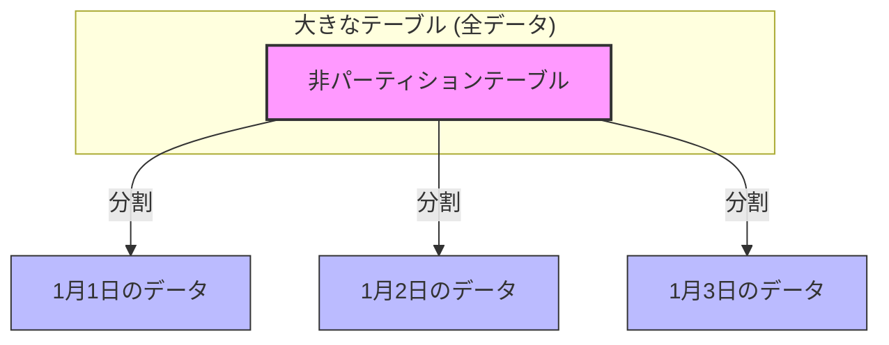
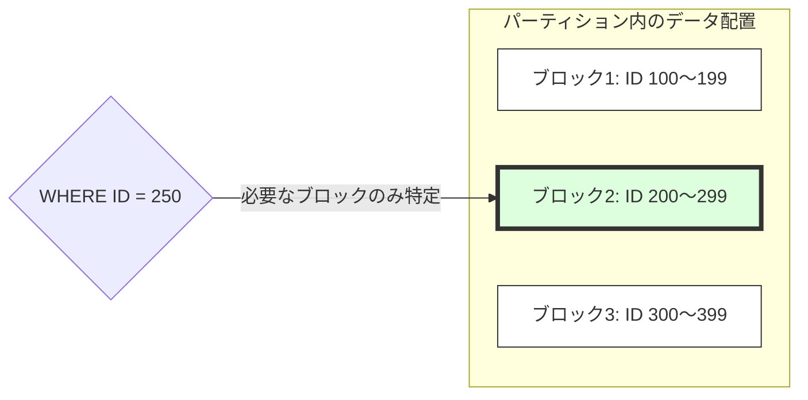
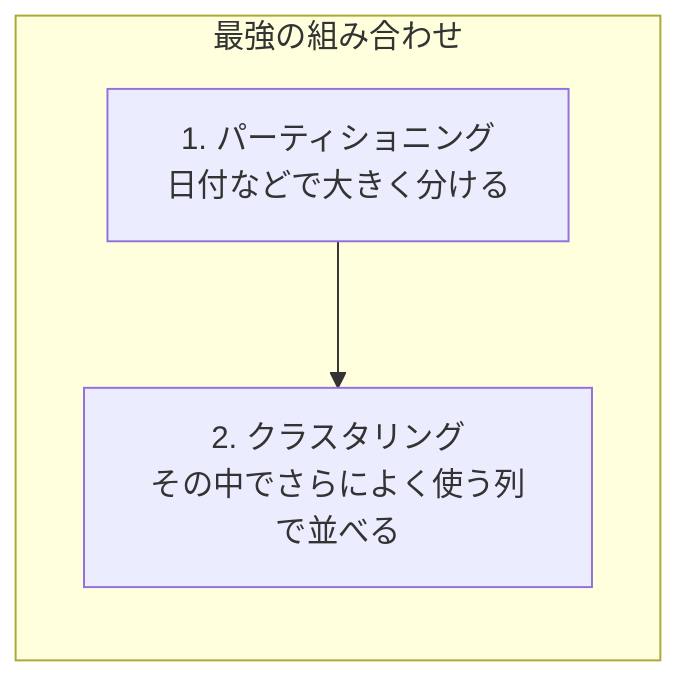

# BigQueryのパーティショニングとクラスタリング

BigQueryで大量のデータを効率よく、かつ安価に扱うためには「パーティショニング」と「クラスタリング」の理解が不可欠です。

---

## 1. パーティショニング（Partitioning）とは

パーティショニングは、**大きなテーブルを特定の列の値に基づいて「物理的な小さな塊（パーティション）」に分割する**機能です。

### メリット
- **コスト削減**: クエリ時に必要なパーティションのみをスキャンするため、フルスキャンを避け、課金額を抑えられます。
- **パフォーマンス向上**: 読み込むデータ量が減るため、クエリの実行速度が上がります。
- **管理の容易化**: 特定の期間のデータ削除などが効率的に行えます。

### 主な種類
1. **時間単位列パーティショニング**: `DATE`、`DATETIME`、`TIMESTAMP` 列に基づいて分割（日、時間、月、年単位）。
2. **取り込み時間パーティショニング**: データがロードされた時間（`_PARTITIONTIME`）に基づいて自動的に分割。
3. **整数範囲パーティショニング**: `INTEGER` 列の数値範囲に基づいて分割。

---

## 2. クラスタリング（Clustering）とは

クラスタリングは、**パーティション（またはテーブル全体）内のデータを、特定の列の値に基づいて「並べ替えて配置」する**機能です。

### メリット
- **フィルタリングの高速化**: `WHERE` 句で指定した列がクラスタ化されている場合、該当するデータの場所を特定しやすくなります。
- **集計の効率化**: 同じ値が近くに配置されるため、`GROUP BY` などの処理が高速になります。
- **さらなるコスト削減**: パーティショニングと組み合わせることで、スキャン範囲をさらに絞り込めます。

---

## 3. パーティショニング vs クラスタリング：使い分けのポイント

| 特徴 | パーティショニング | クラスタリング |
| :--- | :--- | :--- |
| **仕組み** | 物理的な分割 | データの並べ替え |
| **主な用途** | 日付や時間の管理、大きな粒度での分割 | 頻繁に検索条件（フィルタ）に使う列の最適化 |
| **制限** | パーティション数に上限がある（最大4,000程度） | 上限はない |
| **料金** | クエリコストが明確に減る | スキャン範囲が絞られた分だけ減る |

### どちらを使うべき？
- **基本は「両方の組み合わせ」**: 
  - まず、日付などの時間軸で**パーティショニング**を行い（例：`event_date`）、
  - その中でよく検索条件に使うIDやカテゴリなどで**クラスタリング**を行う（例：`user_id`, `category`）のがベストプラクティスです。
- **カーディナリティ（値の種類）が高い場合**:
  - 値の種類が非常に多い列（例：ユーザーIDなど）を分割したい場合は、パーティショニングの上限に達してしまうため、クラスタリングが適しています。

---

## まとめ
- **パーティショニング**は「大きな引き出しを小さな段に分ける」イメージ。
- **クラスタリング**は「引き出しの中身をアイウエオ順に並べる」イメージ。

これらを適切に設定することで、BigQueryのパフォーマンスを最大限に引き出し、運用コストを最小限に抑えることができます。

---
参照元: [BigQuery パーティション分割テーブルの概要 | Google Cloud](https://docs.cloud.google.com/bigquery/docs/partitioned-tables?hl=ja)
