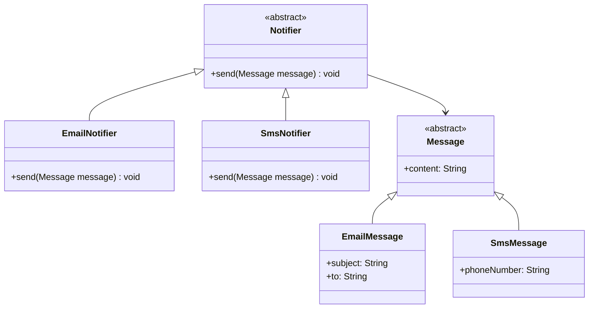
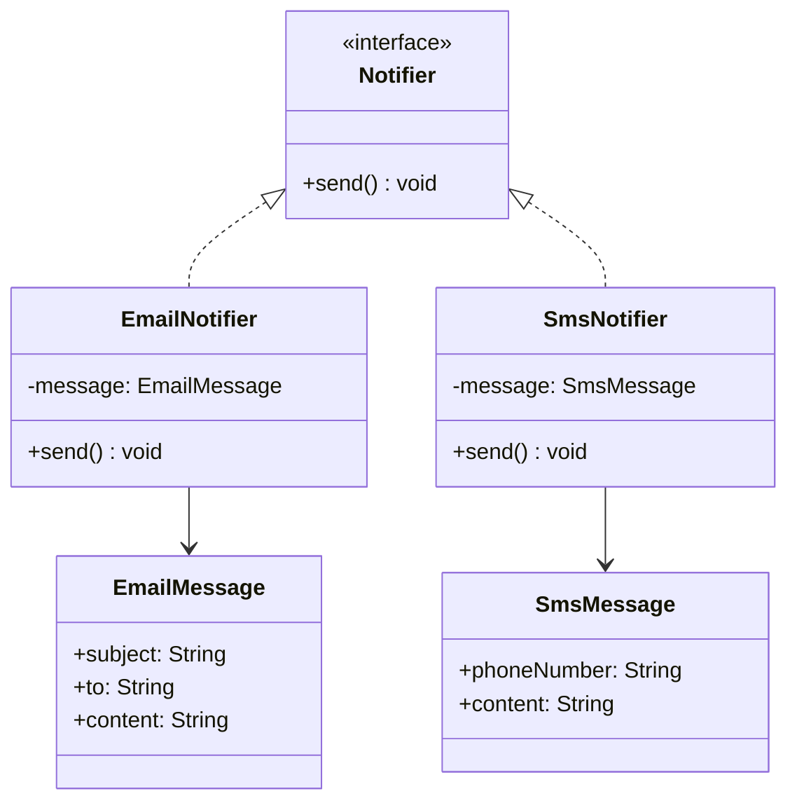
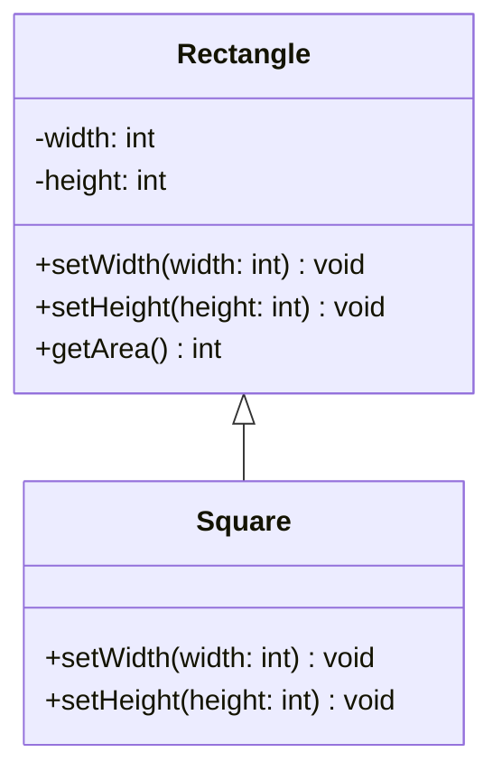
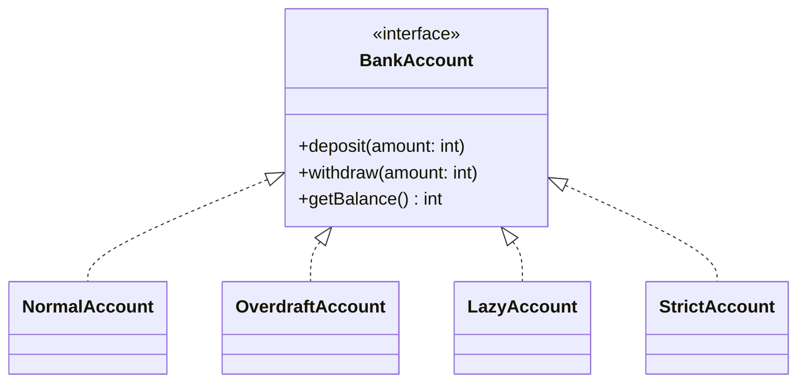
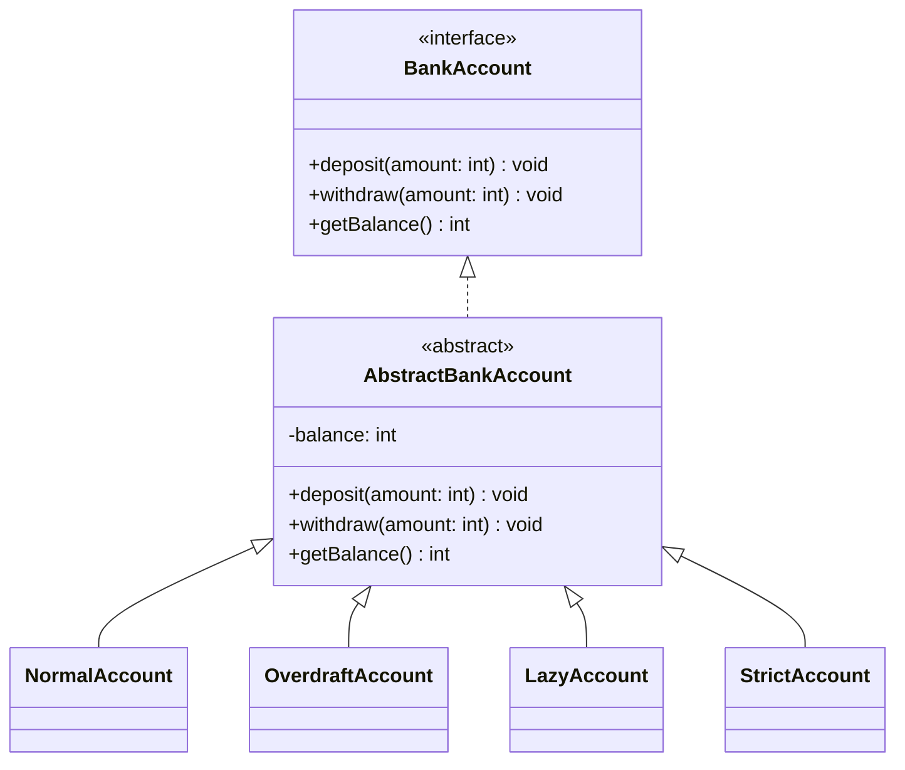
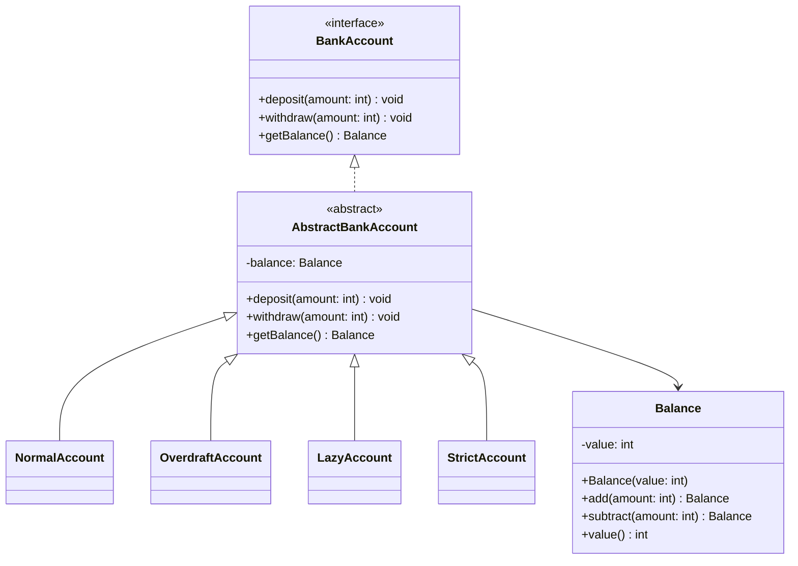

リスコフの置換原則(Liskov Substitution Principle)に関してのまとめです。
解説記事ではなく、自身の理解を深めるための引用集。
【深掘り】とかの項目にわけていますが、興味をもとにいろんな方向に派生します。

Wikipediaには、以下のように記載されている。
> **リスコフの置換原則**（りすこふのちかんげんそく、[英](https://ja.wikipedia.org/wiki/%E8%8B%B1%E8%AA%9E): Liskov substitution principle）は、[オブジェクト指向プログラミング](https://ja.wikipedia.org/wiki/%E3%82%AA%E3%83%96%E3%82%B8%E3%82%A7%E3%82%AF%E3%83%88%E6%8C%87%E5%90%91%E3%83%97%E3%83%AD%E3%82%B0%E3%83%A9%E3%83%9F%E3%83%B3%E3%82%B0)において、[サブタイプ](https://ja.wikipedia.org/wiki/%E3%82%B5%E3%83%96%E3%82%BF%E3%82%A4%E3%83%94%E3%83%B3%E3%82%B0_\(%E8%A8%88%E7%AE%97%E6%A9%9F%E7%A7%91%E5%AD%A6\))のオブジェクトはスーパータイプのオブジェクトの仕様に従わなければならない、という原則である。

もう少ししっかりいうと、
> SがTの派生型であるならば、プログラム内でT型のオブジェクトが使われている箇所は全てS型のオブジェクトで置換可能

という原則である。
Tはオブジェクトやクラスとは限らず、現代であればインターフェースなどで表現されることが多い。
Tは「仕様書」であり、Sは「それ（T）の実装」という構造となっており、たとえばTの派生であるS1、S2、S3、S4というオブジェクトが存在していた場合、Tという文脈においてS1→S3やS4→S1に置換しても、問題なく動作しなければいけない、ということになる。


# 原則を満たすための条件

以下の4つの項目を守る必要があるとされている。
> 1. 事前条件（preconditions）を、派生型で強めることはできない。派生型では同じか弱められる。
> 2. 事後条件（postconditions）を、派生型で弱めることはできない。派生型では同じか強められる。
> 3. 不変条件（invaritants）は、派生型でも保護されねばならない。派生型でそのまま維持される。
> 4. 基底型の例外（exception）から派生した例外を除いては、派生型で独自の例外を投げてはならない。

ここでは各条件について具体的な例を挙げつつ理解していく。
また、条件を「強める」「弱める」については、以下の記載を前提にして進めていく。
> 条件を強めるとはプロセス上の状態の取り得る範囲を狭くすることであり、条件を弱めるとはプロセス上の状態の取り得る範囲を広くすることである。

[リスコフの置換原則 - Wikipedia](https://ja.wikipedia.org/wiki/%E3%83%AA%E3%82%B9%E3%82%B3%E3%83%95%E3%81%AE%E7%BD%AE%E6%8F%9B%E5%8E%9F%E5%89%87)

## 1. 事前条件（preconditions）を、派生型で強めることはできない。派生型では同じか弱められる。



この図の何が問題か。
```
Notifier.send(Message)
  → どの Message でもよさそう
EmailNotifier.send(Message)
  → 実際は EmailMessage だけ
SmsNotifier.send(Message)
  → 実際は SmsMessage だけ
```

まずは「事前条件」とはなんなのかを深掘り。

 > 事前条件 (precondition) は、メソッド開始時に保証されるべき条件の表明である[[9]](https://ja.wikipedia.org/wiki/%E5%A5%91%E7%B4%84%E3%83%97%E3%83%AD%E3%82%B0%E3%83%A9%E3%83%9F%E3%83%B3%E3%82%B0#cite_note-FOOTNOTEMeyer1990155,_157,_218-13)。事前条件はメソッドごとに定義され、以下に関する制約を与える：
 > 
 > 1. メソッドの[引数](https://ja.wikipedia.org/wiki/%E5%BC%95%E6%95%B0 "引数")
 > 2. メソッド開始時のサプライヤクラスのインスタンスの状態
https://ja.wikipedia.org/wiki/%E5%A5%91%E7%B4%84%E3%83%97%E3%83%AD%E3%82%B0%E3%83%A9%E3%83%9F%E3%83%B3%E3%82%B0


改めてNotifierを見ると、`send` の事前条件は「全てのメッセージ」であるのに対し、
- EmailNotifierの事前条件は「EmailMessage」のみ
- SmsNotifierの事前条件は「SmsMessage」のみ
といった形で、「事前条件を狭める（強める）」形となってしまっている。
この結果、「事前条件は派生型（サブタイプ）では同じか弱められる」という条件に反してしまっている。

じゃあどうすればいいのか。


この例ではインターフェースとして定義されたNotifierの契約は「send() ができる」という点であり、サブクラスであるEmailNotifierやSmsNotifierも同じように「send() ができる」振る舞いを持つ、という状態である。
親（この場合はインターフェース）が持つ契約は、子においても同じように振る舞える必要があり、固有の呼び出し方（事前条件の強化）は許可されない、ということがこの原則の肝となる。

## 2. 事後条件（postconditions）を、派生型で弱めることはできない。派生型では同じか強められる。

こちらもまずは、事後条件とはなんなのかについて。

> 事後条件 (postcondition) は、メソッド正常終了時に保証されるべき条件の表明である。これはメソッド単位で表明される。正常終了とは、例外スロー終了やエラー発生終了ではないことを指す。具体的には以下になる。
> 
> 1. メソッド開始時のサプライヤクラスのインスタンスの状態
> 2. メソッド正常終了時のサプライヤクラスのインスタンスの状態
> 3. クライアントに渡す[返り値](https://ja.wikipedia.org/wiki/Return%E6%96%87 "Return文")

たとえば、 `int Add(int x, int y)` というメソッドがあった場合、「xとyを足した値を返す」ということが事後条件にあたる。

これを先ほどの事前条件と同じく、Notifierインターフェースで例えてみる。
```java
interface Notifier {
    void send();
}
```

このインターフェースの場合、呼び出し側は実装として以下のような事後条件を期待することになる（暗黙の事後条件）。
- 通知が送信されている
- エラーがなければ成功する
- 状態が不正にならない

OKな例（EmailNotifierクラスでの超シンプルな形）
```java
class EmailNotifier implements Notifier {
    private EmailMessage message;

    @Override
    public void send() {
        // メール送信
        mailClient.send(message);
        
        // 送信済みフラグなど
        message.markSent();
    }
}

```

sendを利用する側から読んだ場合、期待通りにメール送信されることが保証されている。
「送信済みフラグ」を追加しているが、これは「事後条件を強める（送信に加えて、条件を追加する）」ということになるため、リスコフの置換原則には準じている形となる。

NGな例①
```java
class SmsNotifier implements Notifier {
    @Override
    public void send() {
        throw new RuntimeException("エラーが発生");
    }
}
```

この場合、明らかに「send() を読んだ場合、通知が送信される」という契約に違反してしまっているため、リスコフの置換原則に違反している。
（呼び出し側が防御する必要がある状態になってしまっている）

NGな例②
```java
class SmsNotifier implements Notifier {
    private SmsMessage message;

    @Override
    public void send() {
        if (message.getPhoneNumber() == null) {
            return; // 何もしない
        }
        smsClient.send(message);
    }
}
```

messageオブジェクトのphoneNumberプロパティがnullであれば何もしない、というパターン。
こちらは `send()` を実行した際に、「通知が送信されない可能性がある」という状態になってしまっている。元々親クラスで契約された「通知が送信されている」という事後条件を意図的に弱める形となってしまっており、これもリスコフの置換原則としてはNGである。

このように、親クラスを継承した子クラスに実装される `Notifier.send()`は実行された際に、「通知が送信される」ということが保証されるべきであり、`EmailNotifier.send()` では確実に通知が送信されるが、`SmsNotifier.send()` ではある特定の条件下のみ、通知が送信される、という状況になってはいけない、ということになる。

### 【掘り下げ】正方形・長方形問題
この事前条件と事後条件において、「Rectangleクラスを継承したSquareクラス」がリスコフの置換原則に違反した例としてよく取り上げられてるのを見たので、取り上げておきたい。

数学的には、「正方形は長方形の一種」であると言われている。

> 正方形は[正多角形](https://ja.wikipedia.org/wiki/%E6%AD%A3%E5%A4%9A%E8%A7%92%E5%BD%A2 "正多角形")の一種であり、また[長方形](https://ja.wikipedia.org/wiki/%E9%95%B7%E6%96%B9%E5%BD%A2 "長方形")、[菱形](https://ja.wikipedia.org/wiki/%E8%8F%B1%E5%BD%A2 "菱形")、[平行四辺形](https://ja.wikipedia.org/wiki/%E5%B9%B3%E8%A1%8C%E5%9B%9B%E8%BE%BA%E5%BD%A2 "平行四辺形")、[台形](https://ja.wikipedia.org/wiki/%E5%8F%B0%E5%BD%A2 "台形")、[凧形](https://ja.wikipedia.org/wiki/%E5%87%A7%E5%BD%A2 "凧形")の特殊な形だと考えることもできる。
> 
> 正方形は、全て角の角度が等しいという性質を持っている。従って、正方形は長方形の一種である。
> 一方、長方形は「4つの辺の長さが全て等しい」という性質は持っていない。従って、長方形は一般には正方形ではない。

[正方形 - Wikipedia](https://ja.wikipedia.org/wiki/%E6%AD%A3%E6%96%B9%E5%BD%A2)

> [正方形](https://ja.wikipedia.org/wiki/%E6%AD%A3%E6%96%B9%E5%BD%A2 "正方形")は長方形の特殊な形で、4つの角がすべて等しく、4つの辺がすべて等しい四角形である。つまり、正方形は長方形の一種であり、かつ[菱形](https://ja.wikipedia.org/wiki/%E8%8F%B1%E5%BD%A2 "菱形")の一種である。ただし、日常的な言葉では正方形と長方形は別のものとして扱う[[1]](https://ja.wikipedia.org/wiki/%E9%95%B7%E6%96%B9%E5%BD%A2#cite_note-1)。
> 
>脚注：
>新明解国語辞典では長方形を「広義では正方形を含み、狭義では除外する」とされる。

[長方形 - Wikipedia](https://ja.wikipedia.org/wiki/%E9%95%B7%E6%96%B9%E5%BD%A2)

長方形には
- 4つの角が全て等しい（90度）
- 二組の対辺がそれぞれ等しい
という特徴がある。上記の特徴を満たした上で、かつ、「すべての辺の長さが等しい長方形」を「正方形」という名前で定義できることになる。

こちらを踏まえて、オブジェクト指向プログラミング的観点に落とし込んで、正方形は長方形のサブタイプという形で定義をしてみる。



この定義においてRectangleクラスのsetWidthやsetHeightは、それぞれ幅と高さを設定することを期待しており、2つの値が異なっていることを前提としている。
```java
Rectangle rectangle = new Rectangle();

rectangle.setWidth(5);
rectangle.setHeight(10);

int area = rectangle.getArea(); // 50
```

しかし、子クラスのSquareの実装では、前提として幅と高さは同じにならなければいけない。つまり、実装としては以下のようになってしまうことになる。
```java
class Square extends Rectangle {
    @Override
    public void setWidth(int width) {
        this.width = width;
        this.height = width;
    }

    @Override
    public void setHeight(int height) {
        this.width = height;
        this.height = height;
    }
}
```

これによって何が起こるのかというと、Squareは「Rectangleとして扱うことができない」という問題が発生する。たとえば、以下のような場合

```java
void resize(Rectangle rectangle) {
    rectangle.setWidth(5);
    rectangle.setHeight(10);

    if (rectangle.getArea() != 50) {
        throw new RuntimeException("長方形として扱えない");
    }
}
```

```java
Rectangle rectangle = new Square();
resize(rectangle);
```

呼び出し側はRectangleを前提として`50` を期待していたにもかかわらず、Squareを渡したことによって実際の値が100となってしまう。
これが、「親クラスとして正しく動くコードは、子クラスに置き換えても正しく動くべきである」というリスコフの置換原則に反している、ということになってしまう。

Rectangleにおいて、事後条件は以下のようになっていた。
- setWidth(int w) → widthはwになり、heightは変わらない
- setHeight(int h) → heightはhになり、widthは変わらない

しかし、Squareの場合はこのようになる。
- Square#setWidth(w) の後：
	- width は w になる
	- height も w になる
つまり、親クラスが保証した高さを指定すると高さが変わり、幅を指定すると幅が変わり、他の値は変わらないという契約を違反してしまっている状態になったことが、問題となってしまった。

※ もう少し踏み込んでみると、Squareは以下のように「事後条件（保証）」を弱めている、と取ることもできる。
たとえばsetWidthの場合
```
親の保証集合：
  { width = w, height unchanged }
  
子の保証集合：
  { width = w, height = w }
```
このように、親がもつ「unchanged（変更されない）」という保証を弱め、変更可能にしてしまっている。とも取れる。
以下のような場合であれば、事後条件は親の条件を満たしつつ「追加している」という理屈になるため、違反しているとはとれない（前提となる親の契約次第である、という点はあるが）。
```
親の保証集合：
  { width = w, height = w }
  
子の保証集合：
  { width = w, height = w * 2 }
```

これを踏まえて、あくまで前提としてRectangleの「それぞれのメソッドで幅・高さを設定する」という契約に対してSquareが違反してしまっている、という条件に加え、幅（高さ）を設定する時に高さ（幅）は「unchangedである」という事後条件を壊してしまっている、という点が明確にリスコフの置換原則に背く形になってしまった。と整理できた。

[Reddit - Please wait for verification](https://www.reddit.com/r/Geometry/comments/1g532ix/is_a_rectangle_a_square_seriously_asking/?tl=ja)

[「リスコフの置換原則」と「正方形は長方形の部分型なのか問題」](https://zenn.dev/nihao/scraps/15ad0792f21d30)

[何故、Squareクラスはリスコフの置換原則（LSP）に違反するのか \| okuzawatsの日記](https://okuzawats.com/blog/square-violate-lsp/)

いろいろ参考になる回答がある質問
> 正方形が長方形の一種であるならば、なぜ正方形は長方形から継承できないのでしょうか？あるいは、なぜそれは悪い設計なのでしょうか？

setterではなく不変にすればいい論
> すべてのオブジェクトが不変であれば、問題はありません。すべての正方形は長方形でもあります。長方形のすべての特性は、正方形の特性でもあります。
> 
> 問題は、オブジェクトを変更する機能を追加したときに発生します。正確には、プロパティの取得メソッドを読み取るだけでなく、オブジェクトに引数を渡すようになったときに発生します。

[object oriented design - Why would Square inheriting from Rectangle be problematic if we override the SetWidth and SetHeight methods? - Software Engineering Stack Exchange](https://softwareengineering.stackexchange.com/questions/238176/why-would-square-inheriting-from-rectangle-be-problematic-if-we-override-the-set)

## 3. 不変条件（invaritants）は、派生型でも保護されねばならない。派生型でそのまま維持される

不変条件とは何か。
>**不変条件**（[英](https://ja.wikipedia.org/wiki/%E8%8B%B1%E8%AA%9E "英語"): invariant）とは、コンピュータプログラムの理論における用語で、ある処理の間、その真理値が真のまま変化しない述語 (predicate) であり、その処理シーケンスに対して不変であるという。
>
>[コンピュータプログラム](https://ja.wikipedia.org/wiki/%E3%83%97%E3%83%AD%E3%82%B0%E3%83%A9%E3%83%A0_\(%E3%82%B3%E3%83%B3%E3%83%94%E3%83%A5%E3%83%BC%E3%82%BF\))は一般にそれを実行したときの変化で表されるが、プログラムの不変条件が何であるかを知ることも同様に重要である。これは特にプログラムについて推論するときに便利である。[コンパイラ最適化](https://ja.wikipedia.org/wiki/%E3%82%B3%E3%83%B3%E3%83%91%E3%82%A4%E3%83%A9%E6%9C%80%E9%81%A9%E5%8C%96 "コンパイラ最適化")の理論、[契約プログラミング](https://ja.wikipedia.org/wiki/%E5%A5%91%E7%B4%84%E3%83%97%E3%83%AD%E3%82%B0%E3%83%A9%E3%83%9F%E3%83%B3%E3%82%B0 "契約プログラミング")の方法論、[プログラムの正しさ](https://ja.wikipedia.org/wiki/%E6%AD%A3%E5%BD%93%E6%80%A7_\(%E8%A8%88%E7%AE%97%E6%A9%9F%E7%A7%91%E5%AD%A6\) "正当性 (計算機科学)")を判定する[形式手法](https://ja.wikipedia.org/wiki/%E5%BD%A2%E5%BC%8F%E6%89%8B%E6%B3%95 "形式手法")など、いずれもプログラムの**不変条件**を重視している。

[不変条件 - Wikipedia](https://ja.wikipedia.org/wiki/%E4%B8%8D%E5%A4%89%E6%9D%A1%E4%BB%B6)

> クラス不変条件(class invariant) は、クラスが持つ公開された各メソッドの開始時と正常終了時に共通して保証されるべき状態についての条件である。ただしの呼び出しに関しては、事後条件としてのみ適用され事前条件として保証する必要はない。（引数や返り値などを制約するメソッド個別の事前/事後条件と異なり）不変条件はインスタンスの状態にのみに対する表明である。インスタンスの「状態」はそのインスタンスのすべて[フィールド](https://ja.wikipedia.org/wiki/%E3%83%95%E3%82%A3%E3%83%BC%E3%83%AB%E3%83%89_\(%E8%A8%88%E7%AE%97%E6%A9%9F%E7%A7%91%E5%AD%A6\) "フィールド (計算機科学)")の値によって決まるため、より具体的には、不変条件はフィールドの値に関する表明となる[[14]](https://ja.wikipedia.org/wiki/%E5%A5%91%E7%B4%84%E3%83%97%E3%83%AD%E3%82%B0%E3%83%A9%E3%83%9F%E3%83%B3%E3%82%B0#cite_note-FOOTNOTEMeyer1990171-21)。
> 
> 不変条件は公開メソッドの事前条件および事後条件として暗黙的に追加される[[14]](https://ja.wikipedia.org/wiki/%E5%A5%91%E7%B4%84%E3%83%97%E3%83%AD%E3%82%B0%E3%83%A9%E3%83%9F%E3%83%B3%E3%82%B0#cite_note-FOOTNOTEMeyer1990171-21)。 不変条件を持つクラスに関して、そのクラスの公開メソッドの呼び出しの際、クライアントはメソッドの事前条件とサプライヤ・クラスの不変条件の両方を満たす義務がある。 またサプライヤは、事前条件（と不変条件）を満たしたメソッド呼び出しに対して、メソッド終了時にそのメソッドの事後条件と不変条件の両方を満たす義務がある。

[契約プログラミング - Wikipedia](https://ja.wikipedia.org/wiki/%E5%A5%91%E7%B4%84%E3%83%97%E3%83%AD%E3%82%B0%E3%83%A9%E3%83%9F%E3%83%B3%E3%82%B0#%E4%B8%8D%E5%A4%89%E6%9D%A1%E4%BB%B6)

コンピュータプログラムの理論の上でも「不変条件」という言葉が存在しているようだが、今回は「契約による設計」をベースにした文脈での不変条件に当てはまると思われるため、こちらにフォーカスをあてていく。

引用を踏まえて平易な表現で改めてみると
> オブジェクトが有効な状態である限り、常に守られている（保証されている）ルールのこと

ということで、「メソッドを呼ぶ前」や「呼んだ後」だけではなく、そのオブジェクトが存在している間は基本的にずっと成り立ち続ける条件である。たとえば、「自然数」を扱うことがクラスの不変条件に該当している場合、その派生型では「0より大きい整数」を扱うことが派生クラスにおいても保証されている必要がある。これは先ほどの「契約プログラミング」の引用に記載されている、以下の項目の通りであるといえる。

> クラス不変条件(class invariant) は、クラスが持つ公開された各メソッドの開始時と正常終了時に共通して保証されるべき状態についての条件である。

例として、先ほどの正方形・長方形を再び挙げることとする。


Rectangleには、次の不変条件が存在している。
> width と height は独立して変更できる

この不変条件は派生型のクラスでも壊してはいけない、ということになるが、Squareは以下のような条件となり、派生型が不変条件を変更してしまう。
> widthとheightは必ず同じ値になる（width == height）

このように、子は親が持つ「常に守るべき状態のルール」を壊してはならないという前提を持つ。これが「不変条件は、派生型でも保護されなければならない」という言葉の意味合いである。


### 【掘り下げ】不変条件の守りかた
各所でクラスの実装例を様々見たり、AIとディスカッションする中で、「不変条件を明示的に守る」のってオブジェクト指向言語で現実なかなか難しい面があるのではないか？ と感じたので「なぜそう感じたのか」と、どのようにして不変条件を保護することができるのか、を整理していく。

たとえば、以下のようなインターフェースを定義するとする。
```java
public interface BankAccount {
    void deposit(int amount);
    void withdraw(int amount);
    int getBalance();
}
```
上記の「銀行口座」を定義するインターフェースにおいて、コード上には記載されていないが「利用者の観点では」以下のような前提を期待されている（暗黙の契約）。
```
【事前条件】
- amount > 0

【事後条件】
- deposit(amount):
    balance が amount 分増える
- withdraw(amount):
    balance が amount 分減る（成功時）

【不変条件】
- balance >= 0
```


このインターフェース `BankAccount` の契約を守った実装をサブクラスで行う場合、ひねりなくストレートに考えると以下のような実装になる。
```java
public class NormalAccount implements BankAccount {
    private int balance = 0;

    @Override
    public void deposit(int amount) {
        if (amount <= 0) throw new IllegalArgumentException();
        balance += amount;
    }

    @Override
    public void withdraw(int amount) {
        if (amount <= 0) throw new IllegalArgumentException();
        if (balance < amount) throw new IllegalStateException();
        balance -= amount;
    }

    @Override
    public int getBalance() {
        return balance;
    }
}
```

この場合、サブクラスである `NormalAccount`では、親の不変条件を守るために各メソッドにて例外処理を実装する。
ここで気になるのが、以下のように多数のサブクラスが存在し得る状況下で、BankAccountの不変条件を担保する場合である。



この図のような関係にある場合、`NormalAccount`, `OverdraftAccount`, `LazyAccount`, `StrictAccount` のすべてがBankAccountによって定義されている契約を守る必要がある。しかし、Interface自体にその不変条件を守るためのロジックは置かれていないため、結果としてはサブクラス側で契約を守るための実装を各所で記述することになってしまう。
これは実装者都合によって左右される構造になっている（契約を理解していない人物が新たなサブクラスを作成したときに、容易に崩壊してしまう）ため、非常にリスクが大きい状態となっている。

このため、現実的に不変条件を守るならば以下のような構造でクラスを定義することになるのではないかと思う。

```java
public interface BankAccount {
    void deposit(int amount);
    void withdraw(int amount);
    int getBalance();
}
```

interfaceは外向きの契約として定義し、実装は基底クラスにて制御する。
```java
public abstract class AbstractBankAccount implements BankAccount {
    private int balance;

    @Override
    public final void withdraw(int amount) {
        if (balance < amount) {
            throw new IllegalStateException();
        }
        balance -= amount;
    }

    @Override
    public final int getBalance() {
        return balance;
    }
}
```



こうすることで、BankAccountの契約はAbstractBankAccountに集約されているため、各サブクラスは契約定義された契約を意識しなくても良い状態となる。

※「継承よりコンポジション、継承より委譲」等についての言及はここでは割愛

ここまできたところで、新たな問いとして
> そもそも抽象クラスであるAbstractBankAccountにbalance（残高）の制御を入れるべきか

という点がある。
これを解決する方法として、現代においてよく話される値オブジェクトがある。
以下のように、`Balance` はそれ単体としてオブジェクトにしてしまうことが堅牢なドメインを表現するのに良さそうだ。
```java
public final class Balance {
    private final int value;

    public Balance(int value) {
        if (value < 0) {
            throw new IllegalArgumentException("balance must be >= 0");
        }
        this.value = value;
    }

    public int value() {
        return value;
    }

    public Balance add(int amount) {
        if (amount <= 0) {
            throw new IllegalArgumentException("amount must be positive");
        }
        return new Balance(this.value + amount);
    }

    public Balance subtract(int amount) {
        if (amount <= 0) {
            throw new IllegalArgumentException("amount must be positive");
        }
        return new Balance(this.value - amount); // ← ここでマイナスなら例外
    }
}
```

先ほどの`AbstractBankAccount` は以下のように定義し直せる。
```java
public abstract class AbstractBankAccount implements BankAccount {
    private Balance balance;

    protected AbstractBankAccount(Balance initialBalance) {
        this.balance = initialBalance;
    }

    @Override
    public final void deposit(int amount) {
        balance = balance.add(amount);
    }

    @Override
    public final void withdraw(int amount) {
        balance = balance.subtract(amount);
    }

    @Override
    public final Balance getBalance() {
        return balance;
    }
}
```

```java
public class NormalAccount extends AbstractBankAccount {
    public NormalAccount(Balance initialBalance) {
        super(initialBalance);
    }
}
```

こうすることで、そもそもの要件である「残高は0以下になってはいけない」ということはコンストラクタで制御しているため、クリアできる。



これによって、Balance(残高)は0以下にならない、という責務に関しては `Balance`クラスが持つことになった。

上記のように、契約による設計はinterfaceのみでは足りていない（定義はできるが、強制はできない）。そのため、実装者が不変条件を知らなくても壊せない構造にすることが重要であり、抽象クラスやValue Objectなどを用いつつ、実装が崩れないように具体的なガードを加えていくことが重要であるといえる。

あくまで「不変条件を扱う際の考え方の整理」が目的であるため、この項は一旦ここまで。
このクラス設計についても様々な問題を孕んでいるため、それは別の記事にて整理していきたい。

【参考諸々】
> 継承使って共通処理を基底クラスに実装するのがなぜマズいか。目的が異なる共通処理が基底クラスに全部書かれてしまうから。そして継承型ごとに実行する/しないの分岐が大量に実装され複雑化してしまう。解決には継承ではなくコンポジション構造にすること。クラスを組み合わせて使う設計にすること。

[X @MinoDriven](https://x.com/MinoDriven/status/1760570376801882150?s=20)

> 複数の異なるクラスで重複するロジックを見つけたら、やるべきは、スーパークラスの抽出ではなく、重複部分を共通部品として抽出して、それぞれのクラスが共通部品を使うようにリファクタリングでする。 実装継承による共通化ではなく、部品組み立て方式（コンポジション）による共通化を選ぶ。

[X @masuda220](https://x.com/masuda220/status/1493385954630922240)

## 4. 基底型の例外（exception）から派生した例外を除いては、派生型で独自の例外を投げてはならない。

記載の通り、子クラスでは、親クラスで想定される例外のほかに独自の例外を投げてはいけないという規則がある。
ここまでの項目で一貫しているのが、リスコフの置換原則は「呼び出し元が型を意識せず使える」ことである。例外も同じで、**呼び出し元が知らない例外が飛んでくると、安全に置き換えられない**状態になってしまう。そのため、例外についても親の前提に沿った形で返却する必要がある。
たとえば、以下のようにPrinterというinterfaceが存在する場合。

例外クラス
```java
// 基底例外
class PrinterException extends Exception {
    public PrinterException(String message) {
        super(message);
    }
}

// ✅ 派生例外（OK）
class TonerEmptyException extends PrinterException {
    public TonerEmptyException() {
        super("トナーが空です");
    }
}

class PaperJamException extends PrinterException {
    private final int trayId;
    private final int pageCount;

    public PaperJamException(int trayId, int pageCount) {
        super("トレイ" + trayId + "の" + pageCount + "ページ目で紙詰まり");
        this.trayId = trayId;
        this.pageCount = pageCount;
    }

    public int getTrayId() { return trayId; }
    public int getPageCount() { return pageCount; }
}

// ❌ 無関係な例外（NG）
class NetworkException extends Exception {
    public NetworkException(String message) {
        super(message);
    }
}
```

interfaceの定義
```java
interface Printer { void print(String document) throws PrinterException; }
```

以下は、interfaceが想定されていない例外を投げているためNGとなる。
```java
// ❌ LSP違反：NetworkException は PrinterException の派生ではない
class LaserPrinter implements Printer {
    @Override
    public void print(String document) throws PrinterException {
        // コンパイルエラー！
        // NetworkException は throws 宣言にないのでそのままでは投げられない
        // → RuntimeException でラップして隠蔽してしまうと例外のthrowが可能になる
        try {
            connectToServer(); // 何らかの処理
        } catch (NetworkException e) {
            // ❌ RuntimeException でラップして契約を迂回している
            throw new RuntimeException("ネットワークエラー", e);
        }
    }

    private void connectToServer() throws NetworkException {
        throw new NetworkException("接続失敗");
    }
}

// 呼び出し元：Printer 型として使っているので RuntimeException を捕まえられない
class PrintService {
    public void printReport(Printer printer) {
        try {
            printer.print("report");
        } catch (PrinterException e) {
            System.out.println("印刷エラー: " + e.getMessage());
        }
        // RuntimeException はここを素通りしてクラッシュする ❌
    }
}
```

OKの例は以下の通り。`PaperJamException` や `PaperJamException`は`PrinterException`の派生のため、呼び出し側は `PrinterException` として例外を処理することが可能になる。このように例外においても子クラスは親の契約に準じた形で、置換可能であることが重要である。
```java
// ✅ PrinterException の派生を投げる
class LaserPrinter implements Printer {
    private int tonerLevel;

    public LaserPrinter(int tonerLevel) {
        this.tonerLevel = tonerLevel;
    }

    @Override
    public void print(String document) throws PrinterException {
        if (tonerLevel == 0) {
            throw new TonerEmptyException(); // ✅ PrinterException の派生
        }
        System.out.println("印刷中: " + document);
    }
}

class InkjetPrinter implements Printer {
    @Override
    public void print(String document) throws PrinterException {
        throw new PaperJamException(1, 3); // ✅ これも PrinterException の派生
    }
}

// 呼び出し元：どの実装に差し替えても catch 節を変える必要がない
class PrintService {
    public void printReport(Printer printer) {
        try {
            printer.print("report");
        } catch (PrinterException e) {
            // TonerEmptyException も PaperJamException もここで捕まる ✅
            System.out.println("印刷エラー: " + e.getMessage());
        }
    }

    public static void main(String[] args) {
        PrintService service = new PrintService();
        service.printReport(new LaserPrinter(0));   // TonerEmptyException
        service.printReport(new InkjetPrinter());   // PaperJamException
        // どちらも呼び出し元のコードは変更不要 ✅
    }
}
```


# LSP不要論？

最後にひとつ。興味深い記事があったので、記事から興味深く感じた内容を引用する。
（内容を踏まえての考察はここでは割愛。別でやりたい）

> **LSP**は長くSOLIDの一角として扱われてきましたが、現在の設計実務から見ると、もはや独立した柱として強く意識する必要はかなり薄れています。これはLSPが間違っていたという話ではなく、LSPが効いていた時代の前提そのものが崩れた、という話です。

> 論点は、「現代の一般的な開発者が、設計の第一級原則として **LSP** を学び続ける必要があるか」です。結論だけ先に言えば、答えはかなりはっきりしていて、**もはや不要**です。ただしその不要とは無価値という意味ではなく、役割が別の仕組みに分解され、吸収され、独立原則でなくなったという意味です。

> 当時は再利用と言えば、今よりずっと**抽象基底クラス**と継承が主役でした。OCPもDIPも、今日ほど「小さなインタフェース」や「依存方向の設計」としては理解されておらず、継承をどう安全に扱うかという色が濃かったのです。その世界ではLSPがSOLIDの一角に置かれるのは自然でした。
> 
> つまり、LSPは昔は必要でした。しかし必要だったのは、**継承中心の設計世界**においてです。

> LSPが不要になったというと、「では置換可能性はもうどうでもいいのか」と思われがちです。もちろんそうではありません。消えたのは**置換可能性**ではなく、それを一つの独立原則としてわざわざ掲げる必要のほうです。置換可能性そのものは、いまでは別の仕組みに**分散吸収**されています。


> 典型的な誤解はこうです。初学者がAnimal継承の例から入ると、「まず世界を親子関係に整理し、その後で例外を子クラスで吸収する」という順番を自然なものだと思い込みます。すると設計の最初の問いが「共通の振る舞いは何か」ではなく、「親クラス名は何か」になります。これはかなりの曲者で、抽象化が**契約の設計**ではなく**分類の命名**にすり替わってしまいます。
> 
> その結果、現場では妙な設計が生まれます。たとえば Device 基底クラスに open、close、read、write、seek、connect、disconnect を全部載せ、実際には半分以上の派生先でアンサポートテッドになるような作りです。これは「とりあえず親を立てた」ことが原因であり、LSP違反というより、LSPを必要とするような継承構図を最初に作ってしまったことが問題です。こういう設計は、初学者ほど「オブジェクト指向っぽい」と感じやすいのがまた厄介です。


[なぜ、SOLIDのリスコフ置換の原則(LSP)はもはや不要なのか？](https://zenn.dev/pdfractal/articles/ddea6faed6f0c4)


# 参考
[【SOLID】リスコフの置換原則を完全に理解したい #C# - Qiita](https://qiita.com/k2491p/items/d442344a462d3a574acc)

[リスコフの置換原則(LSP)をペンギンの例で理解【継承の落とし穴】 \| SOLIDの原則](https://shuji-bonji.github.io/Notes-on-SOLID-Principle/liskov-substitution-principle.html)

[SOLID原則への批判と限界 - 過剰設計を避けるための視点 \| SOLIDの原則](https://shuji-bonji.github.io/Notes-on-SOLID-Principle/solid-criticism.html)

[よくわかるSOLID原則3: L（リスコフの置換原則）｜erukiti](https://note.com/erukiti/n/n88b8ed99f1e1)

[リスコフの置換原則（LSP）をしっかり理解する #プログラミング - Qiita](https://qiita.com/yuki153/items/142d0d7a556cab787fad)

[契約プログラミング - Wikipedia](https://ja.wikipedia.org/wiki/%E5%A5%91%E7%B4%84%E3%83%97%E3%83%AD%E3%82%B0%E3%83%A9%E3%83%9F%E3%83%B3%E3%82%B0)

[リスコフの置換原則（LSP）と契約による設計（DbC）の関連について #Dart - Qiita](https://qiita.com/hiko1129/items/9b3066feffabccf83c16)

「タイプ置換原理」の一つとして、「リスコフの置換原理（則）」が説明されている
[hsc-i.com/pdf/TechnologyColumn7.pdf](http://hsc-i.com/pdf/TechnologyColumn7.pdf)

> 1番信頼できない入力が来るレイヤーである、ユーザーからの入力を受け入れるところはで防御的プログラミングで書き、それ以降のレイヤーは防御的プログラミングにする必要がない。
> 
> 外部に面してるところは何が来るかわからないから防御するしかない。  
しかし、その防御線を超えた後は、身内の同僚達で開発している世界だから同僚を信じる。ルールを守ってるという前提を信じず、防御的なプログラミングを行えばコードの重複率は増え、コード総量も増え、複雑性もあがる。ルールで防御し、ルールが遵守されていることを信じ、全体の保守性を上げるのが、契約による設計の考え方。

[防御的プログラミングと契約プログラミング #ドメイン駆動設計 - Qiita](https://qiita.com/yoshitaro-yoyo/items/bb8cc631276380b68c13#10-%E5%A5%91%E7%B4%84%E3%83%97%E3%83%AD%E3%82%B0%E3%83%A9%E3%83%9F%E3%83%B3%E3%82%B0%E3%81%AF%E7%9B%B8%E4%BA%92%E4%BF%A1%E9%A0%BC%E3%81%8C%E5%89%8D%E6%8F%90)

[契約による設計　C++](http://www.02.246.ne.jp/~torutk/cxx/design/designbycontract.html)

[何故、Squareクラスはリスコフの置換原則（LSP）に違反するのか \| okuzawatsの日記](https://okuzawats.com/blog/square-violate-lsp/)

[「リスコフの置換原則」と「正方形は長方形の部分型なのか問題」](https://zenn.dev/nihao/scraps/15ad0792f21d30)

[オブジェクト思考: is-a関係とhas-a関係: 継承と包含](https://think-on-object.blogspot.com/2011/11/is-ahas-is-ahas-top-is-a-is-b.html)

[契約による設計事始め - Speaker Deck](https://speakerdeck.com/dnskimo/qi-yue-niyorushe-ji-shi-shi-me?slide=54)

